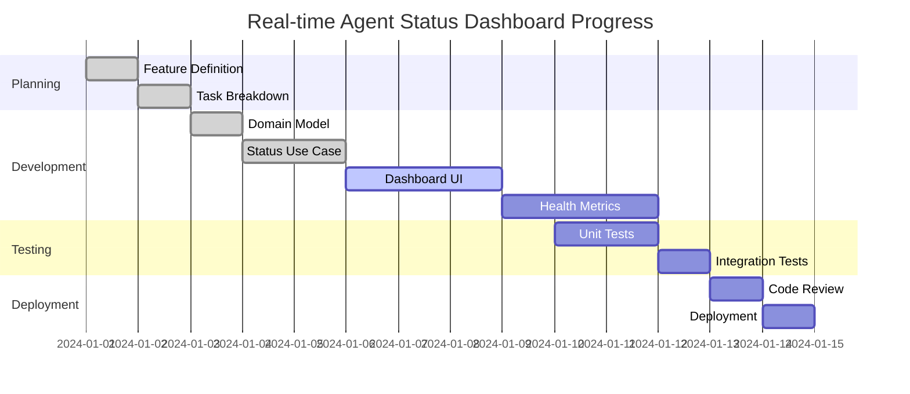

# Feature: Real-time Agent Status Dashboard

## 📋 Feature Overview

**Feature ID**: `real-time-agent-status-dashboard`  
**Entity**: `agent`  
**GitHub Issue**: #42  
**Status**: `in-progress`  
**Priority**: `high`  
**Estimated Effort**: `24h`  
**Actual Effort**: `18h`  

### Business Description
Create a real-time dashboard that displays the current status, health, and performance metrics of all connected agents. The dashboard should provide instant visibility into agent connectivity, task execution status, and system health indicators.

### Business Value
- **Operational Visibility**: Immediate insight into agent fleet status
- **Proactive Monitoring**: Early detection of agent issues
- **Performance Optimization**: Identify bottlenecks and optimization opportunities
- **User Experience**: Reduce response time to agent-related issues

### Acceptance Criteria
- [ ] Display real-time status of all registered agents
- [ ] Show agent health metrics (CPU, memory, connectivity)
- [ ] Provide visual indicators for agent states (online, offline, busy, error)
- [ ] Update dashboard automatically without page refresh
- [ ] Support filtering and sorting of agents
- [ ] Display historical uptime and performance data

---

## 🎯 Scope Definition

### In Scope
- Real-time agent status display
- Basic health metrics visualization
- Socket.IO integration for live updates
- Responsive dashboard UI
- Agent filtering and search functionality

### Out of Scope
- Detailed performance analytics (future feature)
- Agent remote control capabilities
- Historical data storage beyond 24 hours
- Multi-tenant agent management

### Dependencies
- [ ] Socket.IO infrastructure setup - Status: `completed`
- [ ] Agent health monitoring system - Status: `in-progress`
- [ ] UI component library integration - Status: `completed`

---

## 🔧 Technical Architecture

### Affected Components
```
src/core/agent/
├── domain/
│   ├── entities/     # AgentStatus, HealthMetrics
│   └── interfaces/   # IAgentStatusRepository, IHealthMonitor
├── application/
│   ├── use-cases/    # GetAgentStatus, MonitorAgentHealth
│   └── services/     # AgentStatusService, HealthAggregationService
├── infrastructure/
│   └── repositories/ # AgentStatusRepository, HealthMetricsRepository
└── presentation/
    ├── components/   # AgentDashboard, AgentStatusCard, HealthIndicator
    └── hooks/        # useAgentStatus, useRealTimeUpdates
```

### Integration Points
- **Socket.IO Events**: `agent:status:update`, `agent:health:metrics`, `agent:connection:change`
- **API Endpoints**: `/api/agents/status`, `/api/agents/health`
- **External Services**: None

---

## 📝 Atomic Tasks

### Business Logic Tasks

#### Task 1: [AGENT-015] Implement Agent Status Domain Model
- **Status**: `completed`
- **Assignee**: john.doe
- **Estimated**: `4h`
- **Actual**: `3h`
- **GitHub Issue**: #43
- **Pull Request**: #44

**Business Logic**: Define the core domain model for agent status tracking, including status states, health metrics, and business rules for status transitions.

**Acceptance Criteria**:
- [ ] ✅ AgentStatus entity with id, status, lastSeen, healthMetrics properties
- [ ] ✅ Status enum with values: ONLINE, OFFLINE, BUSY, ERROR, MAINTENANCE
- [ ] ✅ HealthMetrics value object with CPU, memory, and connectivity metrics
- [ ] ✅ Business rules for valid status transitions

**Unit Tests Required**:
- [ ] ✅ `AgentStatus.test.ts` - Entity creation and validation
- [ ] ✅ `HealthMetrics.test.ts` - Value object validation and constraints

**Technical Subtasks** (Optional):
- [ ] ✅ Create domain entity: `AgentStatus`
- [ ] ✅ Create value object: `HealthMetrics`
- [ ] ✅ Define status transition rules
- [ ] ✅ Implement validation logic

---

#### Task 2: [AGENT-016] Create Real-time Status Update Use Case
- **Status**: `completed`
- **Assignee**: jane.smith
- **Estimated**: `6h`
- **Actual**: `5h`
- **GitHub Issue**: #45
- **Pull Request**: #46

**Business Logic**: Implement the use case for receiving and processing real-time agent status updates, ensuring data consistency and proper event propagation.

**Acceptance Criteria**:
- [ ] ✅ Process incoming agent status updates
- [ ] ✅ Validate status transitions according to business rules
- [ ] ✅ Persist status changes to repository
- [ ] ✅ Emit events for UI updates
- [ ] ✅ Handle concurrent status updates gracefully

**Unit Tests Required**:
- [ ] ✅ `UpdateAgentStatusUseCase.test.ts` - Use case execution and validation
- [ ] ✅ `AgentStatusService.test.ts` - Service coordination and event handling

**Technical Subtasks** (Optional):
- [ ] ✅ Implement use case: `UpdateAgentStatusUseCase`
- [ ] ✅ Create service: `AgentStatusService`
- [ ] ✅ Add event emission logic
- [ ] ✅ Implement concurrency handling

---

#### Task 3: [AGENT-017] Build Real-time Dashboard UI Component
- **Status**: `in-progress`
- **Assignee**: mike.wilson
- **Estimated**: `8h`
- **Actual**: `6h`
- **GitHub Issue**: #47
- **Pull Request**: #48

**Business Logic**: Create the dashboard UI component that displays agent status information in real-time, with proper state management and user interaction capabilities.

**Acceptance Criteria**:
- [ ] ✅ Display grid of agent status cards
- [ ] ✅ Show real-time status updates without page refresh
- [ ] ✅ Implement filtering by status and entity
- [ ] ✅ Add search functionality by agent name/ID
- [ ] 🔄 Responsive design for mobile and desktop
- [ ] 🔄 Loading states and error handling

**Unit Tests Required**:
- [ ] ✅ `AgentDashboard.test.tsx` - Component rendering and interactions
- [ ] 🔄 `useRealTimeUpdates.test.ts` - Hook functionality and Socket.IO integration

**Technical Subtasks** (Optional):
- [ ] ✅ Create presentation component: `AgentDashboard`
- [ ] ✅ Create component: `AgentStatusCard`
- [ ] ✅ Create hook: `useRealTimeUpdates`
- [ ] 🔄 Implement responsive layout
- [ ] 🔄 Add error boundary

---

#### Task 4: [AGENT-018] Implement Health Metrics Collection
- **Status**: `pending`
- **Assignee**: sarah.johnson
- **Estimated**: `6h`
- **Actual**: `0h`
- **GitHub Issue**: #49
- **Pull Request**: #

**Business Logic**: Implement the system for collecting and aggregating health metrics from agents, including CPU usage, memory consumption, and network connectivity status.

**Acceptance Criteria**:
- [ ] Collect CPU and memory metrics from agents
- [ ] Monitor network connectivity and latency
- [ ] Aggregate metrics over time windows
- [ ] Detect and flag anomalous health conditions
- [ ] Store metrics for dashboard display

**Unit Tests Required**:
- [ ] `HealthMetricsCollector.test.ts` - Metrics collection and validation
- [ ] `HealthAggregationService.test.ts` - Aggregation logic and anomaly detection

**Technical Subtasks** (Optional):
- [ ] Create service: `HealthMetricsCollector`
- [ ] Implement use case: `CollectHealthMetrics`
- [ ] Create repository: `HealthMetricsRepository`
- [ ] Add anomaly detection logic

---

## 🧪 Testing Strategy

### Unit Tests
- **Location**: `src/core/agent/__tests__/`
- **Coverage Target**: 100% for business logic
- **Test Files**:
  - [ ] ✅ `AgentStatus.test.ts`
  - [ ] ✅ `HealthMetrics.test.ts`
  - [ ] ✅ `UpdateAgentStatusUseCase.test.ts`
  - [ ] ✅ `AgentStatusService.test.ts`
  - [ ] 🔄 `HealthMetricsCollector.test.ts`

### Integration Tests
- **Location**: `src/core/agent/__tests__/integration/`
- **Test Files**:
  - [ ] ✅ `AgentStatusIntegration.test.ts`
  - [ ] 🔄 `RealTimeDashboardIntegration.test.ts`

### E2E Tests
- **Location**: `tests/e2e/`
- **Test Files**:
  - [ ] 🔄 `agent-dashboard.e2e.test.ts`

---

## 📊 Progress Tracking

### Progress Visualization


### Task Status Summary
- **Total Tasks**: 4
- **Completed**: 2
- **In Progress**: 1
- **Pending**: 1
- **Blocked**: 0

### Time Tracking
- **Estimated Total**: `24h`
- **Actual Total**: `14h`
- **Variance**: `-10h` (`-42%`)

---

## 🔗 Related Links

- **GitHub Issue**: [#42](https://github.com/your-username/ut-tools-manager/issues/42)
- **Project Board**: [Agent Management Board](https://github.com/your-username/ut-tools-manager/projects/1)
- **Documentation**: [Dashboard Architecture](./docs/agent-dashboard-architecture.md)
- **Design**: [Figma Mockups](https://figma.com/file/dashboard-mockups)

---

## 📝 Notes & Decisions

### Architecture Decisions
- **Decision 1**: Use Socket.IO for real-time updates instead of polling - *Rationale*: Better performance and user experience with instant updates
- **Decision 2**: Implement health metrics as value objects - *Rationale*: Ensures data consistency and encapsulates validation logic

### Blockers & Risks
- **Risk 1**: High frequency of status updates may impact performance - *Mitigation*: Implement throttling and batching mechanisms

### Lessons Learned
- Socket.IO integration requires careful handling of connection states
- Real-time UI updates need proper state management to avoid race conditions
- Health metrics collection should be lightweight to avoid impacting agent performance

---

## ✅ Definition of Done

- [ ] ✅ All acceptance criteria met
- [ ] ✅ All unit tests passing (100% coverage for business logic)
- [ ] 🔄 Integration tests passing
- [ ] 🔄 Code review completed
- [ ] 🔄 Documentation updated
- [ ] ✅ No critical security vulnerabilities
- [ ] 🔄 Performance requirements met
- [ ] 🔄 Accessibility requirements met (if UI changes)
- [ ] 🔄 Feature deployed to staging
- [ ] 🔄 Stakeholder approval received

---

*Last Updated*: 2024-01-08  
*Created By*: Product Team  
*Template Version*: 1.0