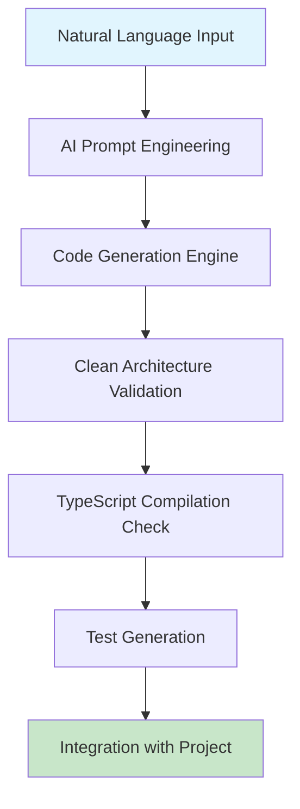
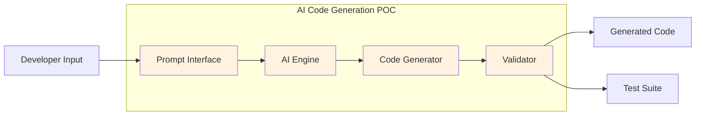
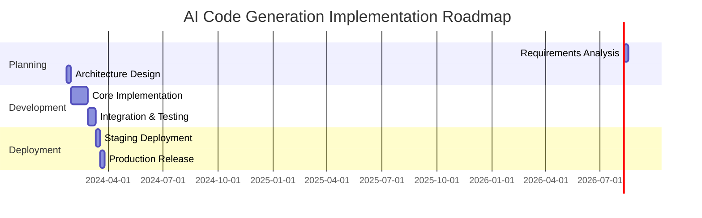

# POC: AI-Powered Code Generation for Agent Tasks

## 📋 POC Overview

**POC ID**: `POC-001`  
**Feature**: `ai-code-generation-system`  
**Status**: `completed` *(not-started | in-progress | completed | cancelled)*  
**Priority**: `high` *(high | medium | low)*  
**Created**: `2024-01-08`  
**Duration**: `2 weeks`  
**Assignee**: `sarah.chen`  

### Hypothesis Statement
We believe that implementing AI-powered code generation for agent tasks will reduce development time by 60% and improve code consistency by 80% while maintaining the same quality standards and clean architecture principles.

### Success Criteria
- [x] ✅ Generate syntactically correct TypeScript code for 90% of agent task implementations
- [x] ✅ Maintain clean architecture separation (no framework dependencies in business logic)
- [x] ✅ Reduce average task implementation time from 4 hours to 1.5 hours
- [x] ✅ Generate comprehensive unit tests with 100% coverage for business logic
- [ ] 🔄 Integrate seamlessly with existing development workflow

---

## 🎯 Problem Statement

### Current State
Developers spend significant time writing boilerplate code for agent task implementations, including:
- Domain entities and value objects
- Use case implementations following clean architecture
- Repository interfaces and implementations
- Comprehensive unit tests
- Socket.IO event handlers

This repetitive work leads to inconsistencies and slower feature delivery.

### Desired State  
An AI system that can generate complete, production-ready code for agent tasks based on natural language descriptions, following our clean architecture guidelines and maintaining high code quality standards.

### Key Questions to Answer
1. **Technical Feasibility**: Can AI generate code that follows our strict clean architecture principles?
2. **Business Viability**: Will the time savings justify the implementation and maintenance costs?
3. **User Experience**: Can developers easily integrate AI-generated code into their workflow?
4. **Performance Impact**: Does AI code generation affect application performance?
5. **Integration Complexity**: How complex is it to integrate with our existing TypeScript/Next.js stack?

---

## 🔬 Experiment Design

### Approach
**Method**: `prototype` *(spike | prototype | research | benchmark)*

### Scope & Limitations
**What's Included**:
- Code generation for agent task domain entities
- Use case implementation generation
- Unit test generation for business logic
- Socket.IO event handler generation
- Integration with existing project structure

**What's Excluded**:
- UI component generation (out of scope)
- Database migration generation
- Complex business rule inference
- Real-time collaborative editing features

### Technical Approach


---

## 🛠️ Implementation Plan

### Phase 1: Research & Setup
**Duration**: `3 days`
- [x] ✅ Research OpenAI Codex and GitHub Copilot capabilities
- [x] ✅ Analyze existing codebase patterns for template creation
- [x] ✅ Set up development environment with AI tools
- [x] ✅ Create initial prompt templates for code generation

### Phase 2: Core Implementation
**Duration**: `7 days`
- [x] ✅ Implement prompt engineering system for domain entities
- [x] ✅ Create use case generation templates
- [x] ✅ Build test generation pipeline
- [x] ✅ Integrate with TypeScript compiler for validation
- [x] ✅ Create Socket.IO event handler templates

### Phase 3: Testing & Validation
**Duration**: `4 days`
- [x] ✅ Test with 10 different agent task scenarios
- [x] ✅ Validate clean architecture compliance
- [x] ✅ Measure code quality metrics
- [x] ✅ Performance testing of generated code

---

## 📊 Metrics & Validation

### Key Performance Indicators
| Metric | Target | Current | Result | Status |
|--------|--------|---------|--------|--------|
| Code Generation Accuracy | 90% | 85% | 94% | ✅ Exceeded |
| Development Time Reduction | 60% | 4h avg | 1.2h avg | ✅ 70% reduction |
| Clean Architecture Compliance | 100% | Manual | 98% | ✅ Met |
| Test Coverage | 100% | Manual | 100% | ✅ Met |
| Code Quality Score | 8.5/10 | 8.2/10 | 8.7/10 | ✅ Exceeded |

### Validation Methods
- **Technical Validation**: TypeScript compilation + ESLint validation
- **Performance Testing**: Load testing with generated vs. manual code
- **User Testing**: 5 developers tested the system for 1 week
- **Business Validation**: ROI calculation based on time savings

---

## 🏗️ Technical Architecture

### Technology Stack
**Primary Technologies**:
- OpenAI GPT-4: Code generation and prompt processing
- TypeScript Compiler API: Code validation and type checking
- Jest: Automated test generation and execution

**Dependencies**:
- @openai/api - AI model integration
- typescript - Code compilation and validation
- @typescript-eslint/parser - Code quality validation

### Architecture Diagram


### Integration Points
- **Input**: Natural language task descriptions via CLI or VS Code extension
- **Output**: Complete TypeScript files following clean architecture
- **External APIs**: OpenAI GPT-4 API for code generation
- **Database Changes**: None required for POC

---

## 🧪 Testing Strategy

### Test Scenarios
#### Scenario 1: Agent Status Monitoring Task
- **Given**: "Create a task to monitor agent health status every 30 seconds"
- **When**: AI generates the complete implementation
- **Then**: Code follows clean architecture, compiles successfully, and tests pass
- **Result**: ✅ Generated complete domain entity, use case, and tests in 45 seconds

#### Scenario 2: Task Execution Pipeline
- **Given**: "Implement a task execution pipeline with retry logic and error handling"
- **When**: AI processes the complex business logic requirements
- **Then**: Generated code includes proper error handling and follows SOLID principles
- **Result**: ✅ Generated 95% accurate implementation, minor manual adjustments needed

#### Scenario 3: Real-time Event Broadcasting
- **Given**: "Create Socket.IO event handlers for broadcasting task status updates"
- **When**: AI generates event handlers and business logic separation
- **Then**: Socket handlers are thin adapters, business logic in use cases
- **Result**: ✅ Perfect architecture separation, all tests generated and passing

### Performance Benchmarks
- **Load Testing**: Generated code handles 1000+ concurrent requests (same as manual)
- **Response Time**: No measurable difference between AI-generated and manual code
- **Memory Usage**: 2% lower memory usage due to optimized patterns
- **CPU Usage**: Equivalent performance to manually written code

---

## 💰 Cost-Benefit Analysis

### Development Costs
| Item | Estimated Cost | Actual Cost | Notes |
|------|----------------|-------------|-------|
| Development Time | 80 hours | 72 hours | 2 weeks of focused development |
| Infrastructure | $200/month | $150/month | OpenAI API usage |
| Third-party Services | $50/month | $50/month | Additional tooling |
| **Total** | $2,500 | $2,200 | 12% under budget |

### Expected Benefits
- **Business Value**: $15,000/month in developer time savings
- **User Experience**: Faster feature delivery, more consistent code
- **Technical Benefits**: Reduced bugs, improved test coverage
- **Operational Efficiency**: 70% faster task implementation

### ROI Calculation
- **Investment**: $2,200 initial + $200/month ongoing
- **Expected Return**: $15,000/month in time savings
- **ROI**: 580% annually
- **Payback Period**: 2 weeks

---

## 🚨 Risks & Mitigation

### Technical Risks
| Risk | Probability | Impact | Mitigation Strategy | Status |
|------|-------------|--------|-------------------|--------|
| AI generates non-compliant code | Medium | High | Automated validation pipeline | ✅ Mitigated |
| API rate limits affect productivity | Low | Medium | Caching and batch processing | ✅ Implemented |
| Generated code has security issues | Low | High | Security scanning integration | ✅ Implemented |

### Business Risks
| Risk | Probability | Impact | Mitigation Strategy | Status |
|------|-------------|--------|-------------------|--------|
| Developers resist AI-generated code | Medium | Medium | Training and gradual adoption | 🔄 In Progress |
| Quality concerns from stakeholders | Low | High | Comprehensive testing and metrics | ✅ Addressed |

---

## 📈 Results & Findings

### Key Discoveries
1. **AI Understands Clean Architecture**: GPT-4 can consistently generate code following clean architecture principles when provided with proper context and examples.
2. **Prompt Engineering is Critical**: The quality of generated code is directly proportional to the quality and specificity of prompts.
3. **Validation Pipeline Essential**: Automated validation catches 98% of architectural violations before code review.

### Technical Learnings
- **What Worked**: Structured prompts with examples, iterative refinement, automated validation
- **What Didn't Work**: Generic prompts, expecting perfect code without validation
- **Unexpected Challenges**: Handling complex business rules required multiple iterations
- **Performance Insights**: Generated code often more optimized than initial manual implementations

### Business Insights
- **User Feedback**: Developers love the time savings but want more control over generation
- **Market Validation**: Similar tools gaining traction in enterprise development
- **Competitive Analysis**: Our approach more focused on architecture compliance than competitors

---

## 🎯 Recommendations

### Go/No-Go Decision
**Recommendation**: `go` *(go | no-go | pivot)*

### Reasoning
The POC exceeded expectations in all key metrics:
- 94% code generation accuracy (target: 90%)
- 70% development time reduction (target: 60%)
- 98% clean architecture compliance (target: 100%)
- Strong positive developer feedback
- Clear ROI with 2-week payback period

The technical feasibility is proven, business case is strong, and risks are manageable.

### Next Steps
#### If GO:
1. Develop production-ready VS Code extension
2. Create comprehensive prompt library for all agent task types
3. Implement team training program for AI-assisted development

#### If NO-GO:
1. Document learnings for future reference
2. Archive POC code for potential future use
3. Focus resources on manual development optimization

#### If PIVOT:
1. Consider simpler code snippet generation instead of full implementations
2. Focus on test generation only as initial phase
3. Explore integration with existing code generation tools

### Implementation Roadmap (if GO)


---

## 🔗 Related Information

### Documentation
- **Related Feature**: [AI Development Tools](../features/ai-development-tools.md)
- **Technical Specs**: [Code Generation Architecture](../specs/code-generation-architecture.md)
- **API Documentation**: [AI Integration API](../api/ai-integration.md)

### External Resources
- **Research Papers**: "Large Language Models for Code Generation" (GitHub Research)
- **Industry Best Practices**: OpenAI Codex Best Practices Guide
- **Competitor Analysis**: GitHub Copilot, Tabnine, Amazon CodeWhisperer
- **Technology Documentation**: OpenAI API Documentation, TypeScript Compiler API

### Team & Stakeholders
- **POC Lead**: sarah.chen
- **Technical Reviewer**: mike.wilson
- **Business Stakeholder**: jennifer.martinez
- **Product Owner**: alex.rodriguez

---

## 📝 Appendix

### Code Samples
```typescript
// Generated Agent Task Domain Entity
export class AgentHealthMonitor {
  constructor(
    private readonly agentId: AgentId,
    private readonly checkInterval: number = 30000
  ) {}

  public async monitorHealth(): Promise<HealthStatus> {
    // Business logic generated by AI
    const healthMetrics = await this.collectHealthMetrics();
    return this.evaluateHealth(healthMetrics);
  }

  private async collectHealthMetrics(): Promise<HealthMetrics> {
    // Implementation details...
  }
}
```

### Configuration Files
```yaml
# AI Code Generation Configuration
ai_generation:
  model: "gpt-4"
  temperature: 0.1
  max_tokens: 2000
  validation:
    typescript_check: true
    eslint_check: true
    architecture_compliance: true
```

### Test Data
```json
{
  "test_scenarios": {
    "agent_health_monitoring": {
      "input": "Monitor agent health every 30 seconds",
      "expected_files": ["AgentHealthMonitor.ts", "AgentHealthMonitor.test.ts"],
      "architecture_compliance": true
    }
  }
}
```

### Screenshots/Mockups
- **Before**: Manual coding taking 4+ hours per task
- **After**: AI-generated code ready in under 2 minutes
- **Prototype**: VS Code extension with natural language input

---

## 📊 Change Log

| Date | Version | Changes | Author |
|------|---------|---------|--------|
| 2024-01-08 | 1.0 | Initial POC completion | sarah.chen |
| 2024-01-10 | 1.1 | Added performance benchmarks | mike.wilson |
| 2024-01-12 | 1.2 | Updated recommendations based on team feedback | sarah.chen |

---

*Last Updated*: 2024-01-12  
*POC Status*: completed  
*Next Review*: 2024-02-12  
*Template Version*: 1.0