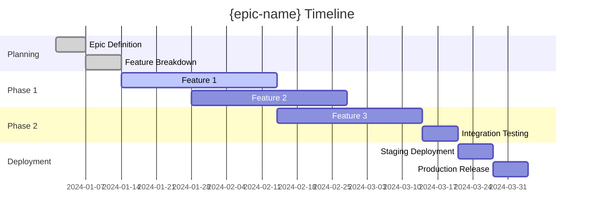

# Epic: {epic-name}

## 📋 Epic Overview

**Document ID**: `{sequential-id}` (e.g., `001`, `002`, `003`)  
**File Name**: `{sequential-id}-epic-{short-description}-{status}.md` (e.g., `001-epic-user-management-draft.md`)  
**GitHub Milestone**: [#{milestone-number}](https://github.com/{repo}/milestone/{milestone-number}) (opcional)  
**Status**: `draft` | `planning` | `ready` | `in_progress` | `review` | `blocked` | `completed` | `cancelled`  
**Priority**: `high` | `medium` | `low`  
**Start Date**: `{start-date}`  
**Target Date**: `{target-date}`  
**Actual Completion**: `{completion-date}`  
**Epic Owner**: `{owner}`  

### Business Vision
<!-- High-level business vision for this epic -->
{business-vision}

### Strategic Goals
<!-- How this epic aligns with business strategy -->
- {strategic-goal-1}
- {strategic-goal-2}
- {strategic-goal-3}

### Success Metrics
<!-- Measurable outcomes that define success -->
- **Metric 1**: {metric-name} - Target: `{target-value}` - Current: `{current-value}`
- **Metric 2**: {metric-name} - Target: `{target-value}` - Current: `{current-value}`
- **Metric 3**: {metric-name} - Target: `{target-value}` - Current: `{current-value}`

---

## 🎯 Epic Scope

### Problem Statement
<!-- What problem does this epic solve? -->
{problem-statement}

### Solution Overview
<!-- High-level solution approach -->
{solution-overview}

### Target Users
<!-- Who will benefit from this epic? -->
- **Primary Users**: {primary-users}
- **Secondary Users**: {secondary-users}
- **Stakeholders**: {stakeholders}

### Business Impact
- **Revenue Impact**: {revenue-impact}
- **Cost Savings**: {cost-savings}
- **User Experience**: {ux-impact}
- **Technical Debt**: {technical-debt-impact}

---

## 🏗️ Architecture Overview

### System Components Affected
```
src/core/
├── agent/          # {agent-changes}
├── manager/        # {manager-changes}
├── task/           # {task-changes}
└── auth/           # {auth-changes}
```

### Integration Points
- **Socket.IO Events**: {socket-events}
- **API Endpoints**: {api-endpoints}
- **External Services**: {external-services}
- **Database Changes**: {database-changes}

### Technical Dependencies
- **Internal Dependencies**: {internal-dependencies}
- **External Dependencies**: {external-dependencies}
- **Infrastructure Requirements**: {infrastructure-requirements}

---

## 📝 Features Breakdown

### Feature 1: {feature-name-1}
- **Status**: `planning` | `in-progress` | `completed` | `blocked`
- **Priority**: `high` | `medium` | `low`
- **Estimated Effort**: `{hours}h`
- **Actual Effort**: `{hours}h`
- **GitHub Issue**: [#{issue-number}](https://github.com/{repo}/issues/{issue-number})
- **Feature Document**: [Link](../features/{feature-name-1}.md)

**Business Value**: {business-value-1}

**Key Tasks**:
- [ ] [ENTITY-001] {task-name-1}
- [ ] [ENTITY-002] {task-name-2}
- [ ] [ENTITY-003] {task-name-3}

---

### Feature 2: {feature-name-2}
- **Status**: `planning` | `in-progress` | `completed` | `blocked`
- **Priority**: `high` | `medium` | `low`
- **Estimated Effort**: `{hours}h`
- **Actual Effort**: `{hours}h`
- **GitHub Issue**: [#{issue-number}](https://github.com/{repo}/issues/{issue-number})
- **Feature Document**: [Link](../features/{feature-name-2}.md)

**Business Value**: {business-value-2}

**Key Tasks**:
- [ ] [ENTITY-004] {task-name-4}
- [ ] [ENTITY-005] {task-name-5}
- [ ] [ENTITY-006] {task-name-6}

---

### Feature 3: {feature-name-3}
- **Status**: `planning` | `in-progress` | `completed` | `blocked`
- **Priority**: `high` | `medium` | `low`
- **Estimated Effort**: `{hours}h`
- **Actual Effort**: `{hours}h`
- **GitHub Issue**: [#{issue-number}](https://github.com/{repo}/issues/{issue-number})
- **Feature Document**: [Link](../features/{feature-name-3}.md)

**Business Value**: {business-value-3}

**Key Tasks**:
- [ ] [ENTITY-007] {task-name-7}
- [ ] [ENTITY-008] {task-name-8}
- [ ] [ENTITY-009] {task-name-9}

---

## 📊 Progress Tracking

### Epic Timeline


### Progress Summary
- **Total Features**: {total-features}
- **Completed Features**: {completed-features}
- **In Progress Features**: {in-progress-features}
- **Pending Features**: {pending-features}
- **Blocked Features**: {blocked-features}

### Effort Tracking
- **Total Estimated**: `{total-estimated}h`
- **Total Actual**: `{total-actual}h`
- **Variance**: `{variance}h` (`{variance-percentage}%`)
- **Remaining Effort**: `{remaining-effort}h`

### Milestone Progress
- **Milestone 1**: {milestone-1-name} - `{completion-percentage}%` complete
- **Milestone 2**: {milestone-2-name} - `{completion-percentage}%` complete
- **Milestone 3**: {milestone-3-name} - `{completion-percentage}%` complete

---

## 🧪 Testing Strategy

### Testing Approach
- **Unit Testing**: 100% coverage for all business logic
- **Integration Testing**: Cross-feature integration points
- **E2E Testing**: Complete user workflows
- **Performance Testing**: Load and stress testing
- **Security Testing**: Vulnerability assessment

### Test Environments
- **Development**: Local development testing
- **Staging**: Pre-production testing
- **Production**: Production monitoring

### Quality Gates
- [ ] All unit tests passing
- [ ] Integration tests passing
- [ ] E2E tests passing
- [ ] Performance benchmarks met
- [ ] Security scan passed
- [ ] Code coverage > 90%

---

## 🚀 Release Strategy

### Release Phases
#### Phase 1: Core Foundation
- **Features**: {phase-1-features}
- **Target Date**: {phase-1-date}
- **Success Criteria**: {phase-1-criteria}

#### Phase 2: Enhanced Functionality
- **Features**: {phase-2-features}
- **Target Date**: {phase-2-date}
- **Success Criteria**: {phase-2-criteria}

#### Phase 3: Advanced Features
- **Features**: {phase-3-features}
- **Target Date**: {phase-3-date}
- **Success Criteria**: {phase-3-criteria}

### Rollback Plan
- **Rollback Triggers**: {rollback-triggers}
- **Rollback Procedure**: {rollback-procedure}
- **Data Migration Rollback**: {data-rollback-procedure}

---

## 🔍 Risk Management

### High-Risk Items
#### Risk 1: {risk-name-1}
- **Probability**: `high` | `medium` | `low`
- **Impact**: `high` | `medium` | `low`
- **Mitigation**: {mitigation-strategy-1}
- **Contingency**: {contingency-plan-1}
- **Owner**: {risk-owner-1}

#### Risk 2: {risk-name-2}
- **Probability**: `high` | `medium` | `low`
- **Impact**: `high` | `medium` | `low`
- **Mitigation**: {mitigation-strategy-2}
- **Contingency**: {contingency-plan-2}
- **Owner**: {risk-owner-2}

### Dependencies & Blockers
- **External Dependency 1**: {dependency-1} - Status: `pending` | `in-progress` | `completed`
- **External Dependency 2**: {dependency-2} - Status: `pending` | `in-progress` | `completed`
- **Blocker 1**: {blocker-1} - Status: `open` | `resolved`

---

## 👥 Team & Resources

### Team Structure
- **Epic Owner**: {epic-owner}
- **Technical Lead**: {tech-lead}
- **Product Owner**: {product-owner}
- **Developers**: {developers}
- **QA Engineers**: {qa-engineers}
- **DevOps**: {devops-engineers}

### Resource Requirements
- **Development Hours**: `{dev-hours}h`
- **QA Hours**: `{qa-hours}h`
- **DevOps Hours**: `{devops-hours}h`
- **Infrastructure Costs**: `${infrastructure-cost}`
- **External Services**: `${external-services-cost}`

---

## 📈 Success Criteria

### Functional Success Criteria
- [ ] All features deliver expected business value
- [ ] All acceptance criteria met
- [ ] Performance requirements satisfied
- [ ] Security requirements satisfied
- [ ] Scalability requirements satisfied

### Business Success Criteria
- [ ] Success metrics targets achieved
- [ ] User adoption targets met
- [ ] Revenue/cost targets achieved
- [ ] Stakeholder satisfaction achieved

### Technical Success Criteria
- [ ] Code quality standards met
- [ ] Test coverage targets achieved
- [ ] Documentation complete
- [ ] Monitoring and alerting in place
- [ ] Disaster recovery tested

---

## 🔗 Related Links

- **GitHub Milestone**: [#{milestone-number}](https://github.com/{repo}/milestone/{milestone-number})
- **Project Board**: [Epic Board](https://github.com/{repo}/projects/{project-id})
- **Requirements Document**: [Link to requirements]
- **Architecture Document**: [Link to architecture]
- **Design Documents**: [Link to designs]

---

## 📝 Epic Log

### Key Decisions
- **{date}**: {decision-description} - *Rationale*: {rationale}
- **{date}**: {decision-description} - *Rationale*: {rationale}

### Major Milestones
- **{date}**: {milestone-description}
- **{date}**: {milestone-description}

### Lessons Learned
- {lesson-1}
- {lesson-2}
- {lesson-3}

### Retrospective Notes
- **What Went Well**: {what-went-well}
- **What Could Be Improved**: {improvements}
- **Action Items**: {action-items}

---

## ✅ Epic Definition of Done

- [ ] All features completed and deployed
- [ ] All success metrics achieved
- [ ] All quality gates passed
- [ ] Documentation complete and up-to-date
- [ ] Team retrospective completed
- [ ] Lessons learned documented
- [ ] Stakeholder sign-off received
- [ ] Production monitoring in place
- [ ] Support documentation created
- [ ] Epic retrospective completed

---

*Last Updated*: {last-updated-date}  
*Created By*: {creator}  
*Template Version*: 1.0