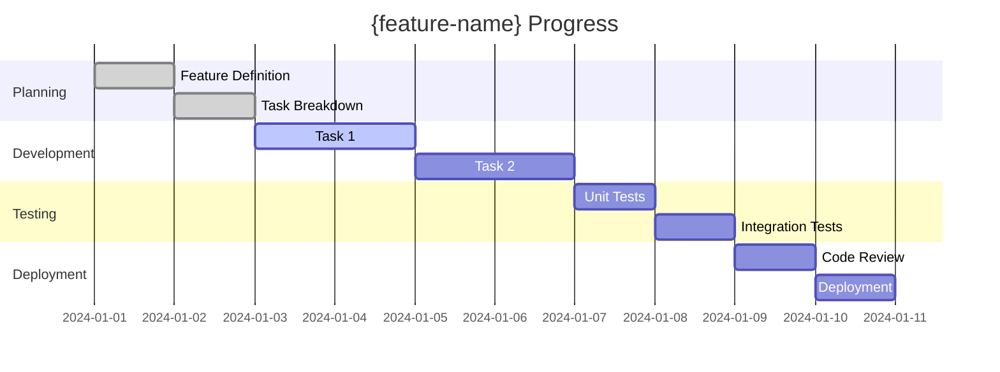

# Feature: {feature-name}

## 📋 Feature Overview

**Document ID**: `{sequential-id}` (e.g., `001`, `002`, `003`)  
**File Name**: `{sequential-id}-feature-{short-description}-{status}.md` (e.g., `001-feature-user-login-draft.md`)  
**Entity**: `{entity}`  
**GitHub Issue**: #{github-issue} (opcional - se puede agregar cuando se cree el issue)  
**Status**: `draft` | `planning` | `ready` | `in_progress` | `review` | `blocked` | `completed` | `cancelled`  
**Priority**: `high` | `medium` | `low`  
**Estimated Effort**: `{hours}h`  
**Actual Effort**: `{hours}h`  

### Business Description
<!-- Clear, non-technical description of what this feature does -->
{business-description}

### Business Value
<!-- Why this feature is important, what problem it solves -->
{business-value}

### Acceptance Criteria
<!-- High-level acceptance criteria for the entire feature -->
- [ ] {acceptance-criterion-1}
- [ ] {acceptance-criterion-2}
- [ ] {acceptance-criterion-3}

---

## 🎯 Scope Definition

### In Scope
- {in-scope-item-1}
- {in-scope-item-2}

### Out of Scope
- {out-of-scope-item-1}
- {out-of-scope-item-2}

### Dependencies
- [ ] {dependency-1} - Status: `pending` | `completed` | `blocked`
- [ ] {dependency-2} - Status: `pending` | `completed` | `blocked`

---

## 🔧 Technical Architecture

### Vertical Slice Delivery Rule
- Every implementation slice must include the full circuit: `UI + API + domain/application + persistence + tests`.
- Do not start slices as backend-only work or as disconnected static UI.
- Break the feature into small, reviewable, demoable deliverables that can be validated independently.

### Affected Components
```
src/core/{entity}/
├── domain/
│   ├── entities/     # {affected-entities}
│   └── interfaces/   # {affected-interfaces}
├── application/
│   ├── use-cases/    # {affected-use-cases}
│   └── services/     # {affected-services}
├── infrastructure/
│   └── repositories/ # {affected-repositories}
└── presentation/
    ├── components/   # {affected-components}
    └── hooks/        # {affected-hooks}
```

### Integration Points
- **Socket.IO Events**: {socket-events}
- **API Endpoints**: {api-endpoints}
- **External Services**: {external-services}

---

## 📝 Atomic Tasks

### Business Logic Tasks
<!-- These map directly to use cases and business rules -->

#### Task 1: [ENTITY-001] {task-name-1}
- **Status**: `pending` | `in-progress` | `completed` | `blocked`
- **Assignee**: {assignee}
- **Estimated**: `{hours}h`
- **Actual**: `{hours}h`
- **GitHub Issue**: #{issue-number}
- **Pull Request**: #{pr-number}

**Business Logic**: {business-logic-description}

**Acceptance Criteria**:
- [ ] {acceptance-criterion-1}
- [ ] {acceptance-criterion-2}
- [ ] {acceptance-criterion-3}

**Unit Tests Required**:
- [ ] `{TestClassName}.test.ts` - {test-description}
- [ ] `{TestClassName}Integration.test.ts` - {integration-test-description}

**Technical Subtasks** (Optional):
- [ ] Create domain entity: `{EntityName}`
- [ ] Implement use case: `{UseCaseName}`
- [ ] Create repository interface: `I{RepositoryName}`
- [ ] Implement repository: `{RepositoryName}`
- [ ] Create presentation component: `{ComponentName}`

---

#### Task 2: [ENTITY-002] {task-name-2}
- **Status**: `pending` | `in-progress` | `completed` | `blocked`
- **Assignee**: {assignee}
- **Estimated**: `{hours}h`
- **Actual**: `{hours}h`
- **GitHub Issue**: #{issue-number}
- **Pull Request**: #{pr-number}

**Business Logic**: {business-logic-description}

**Acceptance Criteria**:
- [ ] {acceptance-criterion-1}
- [ ] {acceptance-criterion-2}

**Unit Tests Required**:
- [ ] `{TestClassName}.test.ts` - {test-description}

**Technical Subtasks** (Optional):
- [ ] {technical-subtask-1}
- [ ] {technical-subtask-2}

---

## 🧪 Testing Strategy

### Unit Tests
- **Location**: `src/core/{entity}/__tests__/`
- **Coverage Target**: 100% for business logic
- **Test Files**:
  - [ ] `{EntityName}.test.ts`
  - [ ] `{UseCaseName}.test.ts`
  - [ ] `{ServiceName}.test.ts`

### Integration Tests
- **Location**: `src/core/{entity}/__tests__/integration/`
- **Test Files**:
  - [ ] `{FeatureName}Integration.test.ts`

### E2E Tests
- **Location**: `tests/e2e/`
- **Test Files**:
  - [ ] `{feature-name}.e2e.test.ts`

---

## 📊 Progress Tracking

### Progress Visualization


### Task Status Summary
- **Total Tasks**: {total-tasks}
- **Completed**: {completed-tasks}
- **In Progress**: {in-progress-tasks}
- **Pending**: {pending-tasks}
- **Blocked**: {blocked-tasks}

### Time Tracking
- **Estimated Total**: `{total-estimated}h`
- **Actual Total**: `{total-actual}h`
- **Variance**: `{variance}h` (`{variance-percentage}%`)

---

## 🔗 Related Links

- **GitHub Issue**: [#{github-issue}](https://github.com/{repo}/issues/{github-issue})
- **Project Board**: [Feature Board](https://github.com/{repo}/projects/{project-id})
- **Documentation**: [Feature Docs](./docs/{feature-name}.md)
- **Design**: [Figma/Design Link]({design-link})

---

## 📝 Notes & Decisions

### Architecture Decisions
- **Decision 1**: {decision-description} - *Rationale*: {rationale}
- **Decision 2**: {decision-description} - *Rationale*: {rationale}

### Blockers & Risks
- **Blocker 1**: {blocker-description} - *Status*: `open` | `resolved`
- **Risk 1**: {risk-description} - *Mitigation*: {mitigation-strategy}

### Lessons Learned
- {lesson-1}
- {lesson-2}

---

## ✅ Definition of Done

- [ ] All acceptance criteria met
- [ ] All unit tests passing (100% coverage for business logic)
- [ ] Integration tests passing
- [ ] Code review completed
- [ ] Documentation updated
- [ ] No critical security vulnerabilities
- [ ] Performance requirements met
- [ ] Accessibility requirements met (if UI changes)
- [ ] Feature deployed to staging
- [ ] Stakeholder approval received

---

*Last Updated*: {last-updated-date}  
*Created By*: {creator}  
*Template Version*: 1.0
