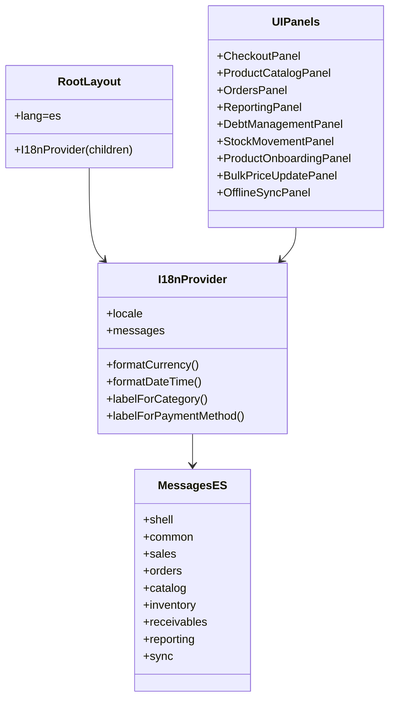
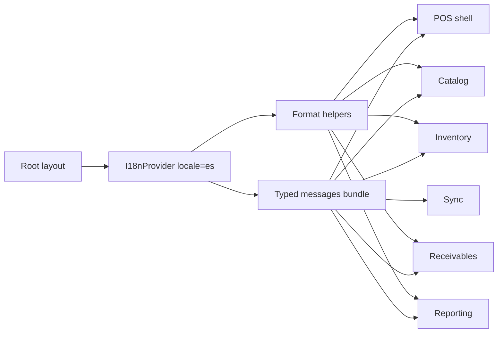

# [I18N-001] Feature: UI Localization to Spanish

## Metadata

**Feature ID**: `I18N-001`
**Status**: `done`
**Priority**: `high`
**Linked FR/NFR**: `NFR-002`, `NFR-005`
**Planning Reference**: `workflow-manager/docs/planning/004-implementation-plan-simple-pos-draft.md`

---

## Business Goal

Translate the full operational UI into Spanish with a reusable i18n foundation so the app avoids embedded strings, keeps terminology consistent across modules, and can add new locales without rewriting components.

## Architecture Artifacts

### Class Diagram

### Flow Diagram

## Acceptance Criteria

- [x] The app renders with `lang="es"`.
- [x] Visible POS components consume a shared typed dictionary.
- [x] Navigation, checkout, catalog, inventory, receivables, reporting, and sync show Spanish copy.
- [x] API validation and feedback messages surfaced in the UI no longer appear in English.
- [x] E2E coverage that validates the UI was updated to Spanish.

## Current Output

- Base i18n infrastructure:
  - `src/infrastructure/i18n/messages.ts`
  - `src/infrastructure/i18n/I18nProvider.tsx`
- `src/app/layout.tsx` now mounts `I18nProvider` and publishes `lang="es"`.
- All visible POS panels consume centralized Spanish messages.
- Categories, payment methods, debt statuses, and movement types use shared provider helpers.
- UI-visible API route and DTO errors/feedback were translated to Spanish.
- UI E2E suites validate headings, actions, and feedback in Spanish.

## Notes

- The solution does not depend on an external library; the app uses a provider and a typed locale bundle.
- Adding another language requires adding a new bundle with the same shape and passing another `locale` to the provider.
