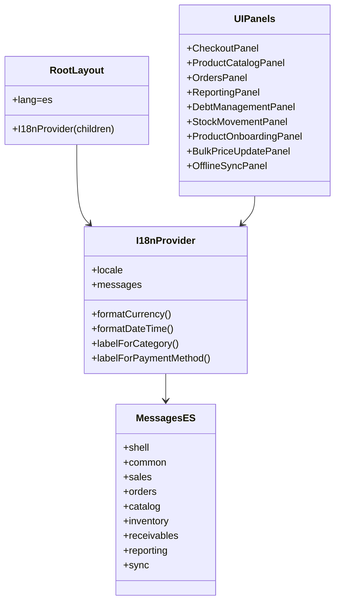
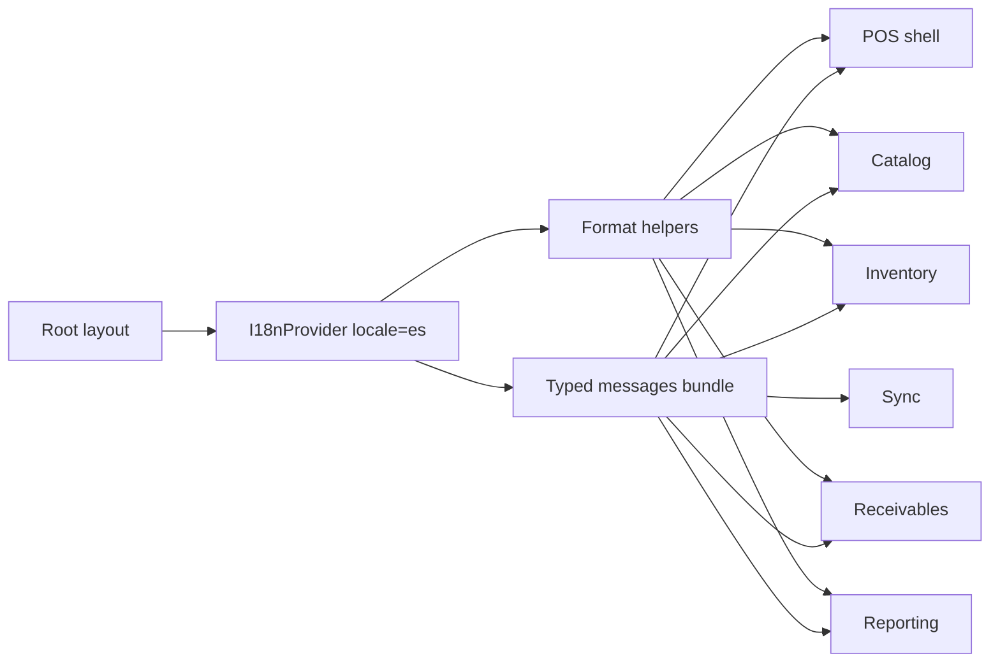

# [I18N-001] Feature: Localización UI a Español

## Metadata

**Feature ID**: `I18N-001`  
**Status**: `done`  
**Priority**: `high`  
**Linked FR/NFR**: `NFR-002`, `NFR-005`  
**Planning Reference**: `workflow-manager/docs/planning/004-implementation-plan-simple-pos-draft.md`

---

## Business Goal

Traducir toda la UI operativa a español con una base i18n reusable para evitar strings embebidos, mantener terminología consistente entre módulos y permitir sumar nuevos locales sin reescribir componentes.

## Architecture Artifacts

### Class Diagram

### Flow Diagram

## Acceptance Criteria

- [x] La app renderiza con `lang="es"`.
- [x] Los componentes visibles del POS consumen un diccionario tipado compartido.
- [x] Navegación, checkout, catálogo, inventario, deudas, reportes y sync muestran copy en español.
- [x] Los mensajes de validación y feedback de API que impactan UI dejaron de salir en inglés.
- [x] Los E2E que validan UI fueron actualizados a español.

## Current Output

- Infraestructura i18n base:
  - `src/infrastructure/i18n/messages.ts`
  - `src/infrastructure/i18n/I18nProvider.tsx`
- `src/app/layout.tsx` ahora monta `I18nProvider` y publica `lang="es"`.
- Todos los paneles visibles del POS consumen mensajes centralizados en español.
- Categorías, métodos de pago, estados de deuda y tipos de movimiento usan helpers compartidos del provider.
- Los errores/feedbacks de rutas API y DTOs visibles desde UI fueron traducidos al español.
- Las suites E2E de UI verifican headings, acciones y feedbacks en español.

## Notes

- La solución no depende de una librería externa; la app usa un provider y un bundle tipado por locale.
- Agregar otro idioma requiere sumar un nuevo bundle con la misma shape y pasar otro `locale` al provider.
