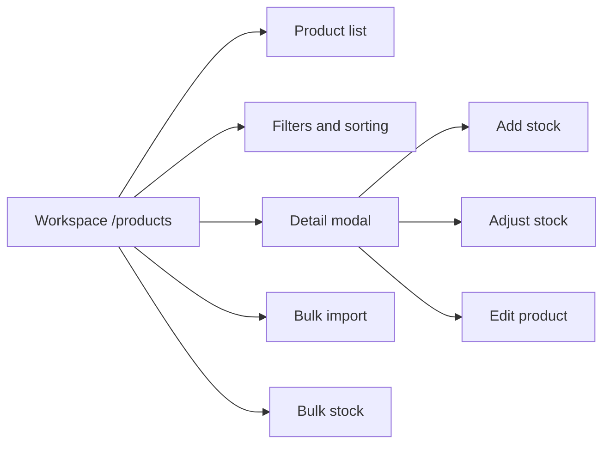
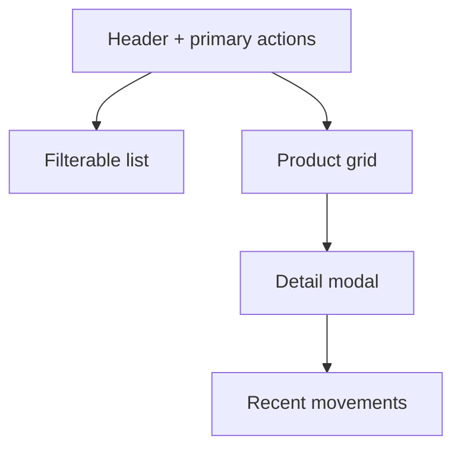

# [PRODUCTS-001] Feature: Visual Mock for Products and Inventory

## Metadata

**Feature ID**: `PRODUCTS-001`
**Status**: `done`
**GitHub Issue**: #30
**Priority**: `high`
**Linked FR/NFR**: `FR-003`, `FR-004`, `NFR-002`, `NFR-005`

---

## Business Goal

Validate a unified `Products and inventory` experience before touching endpoints, use cases, or contracts. The purpose of the mock is to reduce context switching, prioritize large images and readable text, and keep frequent actions close to the selected product.

## Scope

- Adds a new `/products` workspace inside the POS shell.
- Renders local mock data with no API integration.
- Shows:
  - a product list ordered by stock state,
  - useful operational filters,
  - a detailed product sheet in a modal,
  - quick stock/edit actions,
  - visual modals for CRUD and bulk flows.

## UX Direction

- The list prioritizes products with stock and adds visual emphasis for low-stock and out-of-stock states.
- Products use cards aligned with the visual language of `Sales`: white background, no gradients, neutral centered image, and large product name.
- Mock examples are kiosk-oriented to validate fast recognition during daily operation.
- Cards prioritize a large image, visible product name, and short metrics, with tighter spacing so more products fit on screen.
- The desktop target is to get close to 5 products per row without losing basic readability.
- The grid uses `auto-fit` with narrower cards to approach 5 products per row on wide resolutions.
- The grid uses the full available width and moves detail into a modal so the list remains easy to read.
- The header avoids extra explanatory copy to preserve useful vertical space in the workspace.
- Actions are concentrated inside the selected-product modal to reduce visual noise.
- The modal uses internal scroll and a viewport-constrained max height so it does not get clipped on desktop or tablet.
- The side rail and the workspace must scroll correctly inside the shell height without clipping lower content.
- Create, edit, and bulk stock operations live in modals or wizard-like flows.

## Architecture Artifacts

### Flow Diagram

### Layout Diagram

## Current Output

- Navigable mock route in `src/modules/products/presentation/components/ProductsInventoryMockPanel.tsx`
- Current real implementation in `src/modules/products/presentation/components/ProductsInventoryPanel.tsx`
- New workspace wiring in:
  - `src/modules/sales/presentation/posWorkspace.ts`
  - `src/modules/sales/presentation/components/PosLayout.tsx`
- Updated UI smoke coverage including the new preview in:
  - `tests/e2e/ui-vertical-slices-smoke.spec.ts`
- Planned next stage in:
  - `workflow-manager/docs/features/PRODUCTS-002-unified-products-inventory-real-integration-plan.md`

Since `2026-03-01`, `/products` already runs on the real backend and this document remains as the historical visual baseline.

## Explicit Non-Goals

- Does not create new endpoints.
- Does not yet replace the real `Catalog` or `Inventory` screens.
- Does not implement real persistence, real CRUD, or real stock movements.
