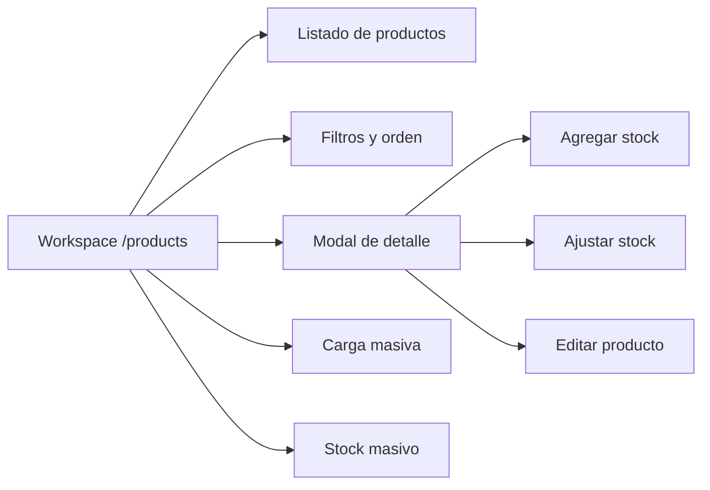
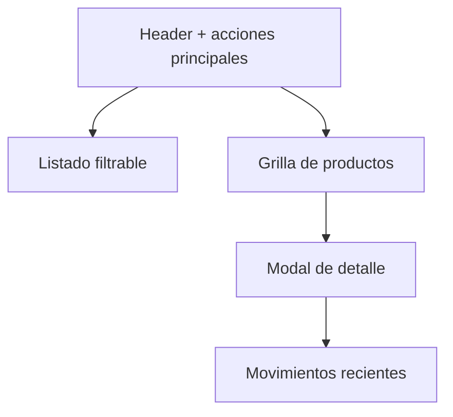

# [PRODUCTS-001] Feature: Mock visual de Productos e Inventario

## Metadata

**Feature ID**: `PRODUCTS-001`
**Status**: `done`
**Priority**: `high`
**Linked FR/NFR**: `FR-003`, `FR-004`, `NFR-002`, `NFR-005`

---

## Business Goal

Validar una experiencia unificada de `Productos e inventario` antes de tocar endpoints, casos de uso o contratos. El foco del mock es reducir cambio de contexto, priorizar imágenes y textos grandes, y acercar acciones frecuentes al producto seleccionado.

## Scope

- Agrega un workspace nuevo `/products` dentro del shell POS.
- Renderiza datos mock locales, sin integración API.
- Muestra:
  - listado de productos ordenado por estado de stock,
  - filtros útiles para operación diaria,
  - ficha detallada del producto en modal,
  - acciones rápidas de stock/edición,
  - modales visuales para CRUD y flujos masivos.

## UX Direction

- La lista prioriza productos con stock y alerta visual de stock bajo/sin stock.
- Los productos se muestran con cards alineadas al lenguaje visual de `Ventas`: fondo blanco, sin gradientes, imagen central neutra y nombre grande.
- Los ejemplos del mock están orientados a kiosko para validar reconocimiento rápido en operación diaria.
- Los cards priorizan imagen grande, nombre visible y métricas cortas, con spacing más compacto para mostrar más productos en pantalla.
- El objetivo visual en desktop ancho es acercarse a 5 productos por fila sin perder legibilidad básica.
- La grilla usa `auto-fit` con cards más angostas para acercarse a 5 productos por fila en resoluciones anchas.
- La grilla ocupa todo el ancho disponible y el detalle vive en un modal para no comprimir la lectura del listado.
- El header evita copy explicativo extra para conservar alto útil del workspace.
- Las acciones se concentran en el modal del producto seleccionado para evitar ruido visual.
- El modal usa scroll interno y altura máxima del viewport para no cortarse en desktop o tablet.
- El rail lateral y el workspace deben scrollear correctamente dentro del alto del shell sin recortar el contenido inferior.
- Las operaciones de alta/edición/stock masivo viven en modales o flujos tipo wizard.

## Architecture Artifacts

### Flow Diagram

### Layout Diagram

## Current Output

- Ruta mock navegable en `src/modules/products/presentation/components/ProductsInventoryMockPanel.tsx`
- Implementacion real actual en `src/modules/products/presentation/components/ProductsInventoryPanel.tsx`
- Workspace nuevo en:
  - `src/modules/sales/presentation/posWorkspace.ts`
  - `src/modules/sales/presentation/components/PosLayout.tsx`
- Smoke UI actualizado para incluir la nueva preview en:
  - `tests/e2e/ui-vertical-slices-smoke.spec.ts`
- Siguiente etapa planificada en:
  - `workflow-manager/docs/features/PRODUCTS-002-unified-products-inventory-real-integration-plan.md`

Desde `2026-03-01`, `/products` ya corre con backend real y este documento queda como baseline visual historica.

## Explicit Non-Goals

- No crea endpoints nuevos.
- No reemplaza todavía las pantallas reales de `Catálogo` ni `Inventario`.
- No implementa persistencia, CRUD real ni movimientos reales.
