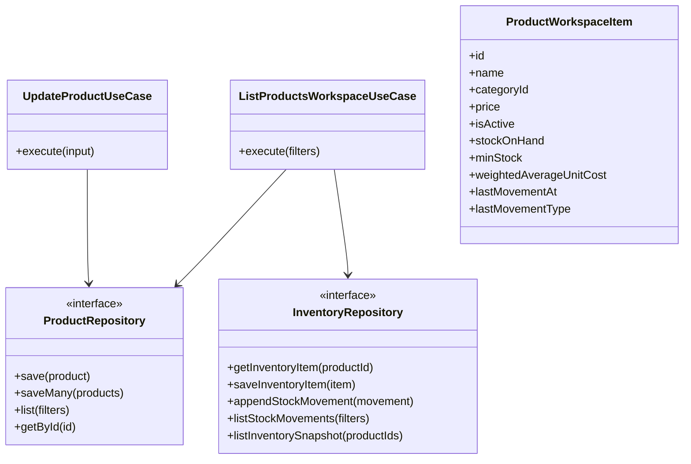
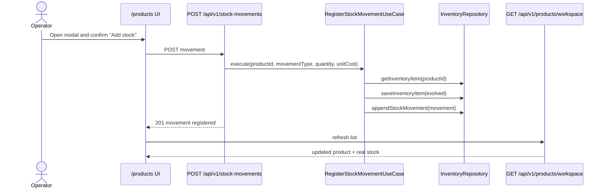
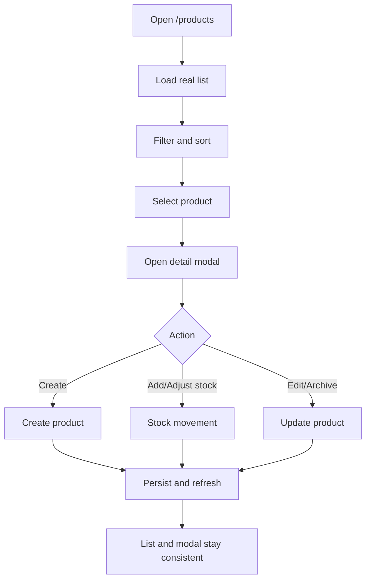

# [PRODUCTS-002] Feature: Real Products and Inventory Integration

## Metadata

**Feature ID**: `PRODUCTS-002`
**Status**: `done`
**GitHub Issue**: #31
**Priority**: `high`
**Linked FR/NFR**: `FR-003`, `FR-004`, `FR-007`, `FR-008`, `FR-015`, `NFR-002`, `NFR-003`, `NFR-005`

---

## Business Goal

Turn `/products` from a visual mock into a real operational workspace, without mixing domains or duplicating business logic that already exists in `catalog` and `inventory`.

The goal is not only to "draw the screen", but to close the full loop:

- usable UI for daily operations,
- consistent persistence,
- real product and stock commands,
- end-to-end flow coverage against the real backend.

---

## Current Baseline

Today the system already has:

- Approved mock UI in `src/modules/products/presentation/components/ProductsInventoryMockPanel.tsx`
- `GET /api/v1/products`
- `POST /api/v1/products`
- `POST /api/v1/products/price-batches`
- `GET /api/v1/stock-movements`
- `POST /api/v1/stock-movements`

Planning-time gaps (closed unless explicitly noted in the audit section below):

- There was no unified read model for `product + stock + average cost + last movement`.
- There was no `PATCH /api/v1/products/:id` to edit/archive products.
- There was no real bulk import for products or stock.
- Visible stock currently has a model inconsistency:
  - `products.stock` exists in catalog
  - `inventory_items.stock_on_hand` exists in inventory
  - `CreateProductUseCase` creates a product with `initialStock`, but does not initialize `inventory_items`
  - `RegisterStockMovementUseCase` mutates `inventory_items`, not `products.stock`

Before connecting the new workspace, the system needs a single stock source of truth.

---

## Architecture Decision

### Pattern Choice

For this problem the right fit is **Read Model / Query Model + existing command use cases**.

Reason:

- `/products` needs aggregated data from `catalog` + `inventory`
- write operations should remain clearly separated commands (`create product`, `register stock movement`, `bulk price update`, etc.)
- this avoids turning `GET /api/v1/products` into an oversized administrative endpoint

### Source of Truth for Stock

For `PRODUCTS-002`, the visible stock in the workspace must come from `inventory_items.stock_on_hand`.

`products.stock` should remain:

- a temporary legacy compatibility field,
- or a future deprecation/migration candidate,
- but not the source of truth for the unified workspace.

---

## Target Outcome

When the feature is complete:

- `/products` lists real products with filters, sorting, and pagination
- each card shows real current stock, minimum stock, price, and status
- the detail modal shows real data and recent movements
- `New product`, `Add stock`, `Adjust stock`, `Edit product`, and `Archive` work
- changes persist after reload
- the real circuit is covered by UI, API, persistence, and logic tests

## Implementation Snapshot

Delivered on `2026-03-01`:

- migration `20260301110000_products_workspace_real_integration.sql` with `sku`, `min_stock`, and `inventory_items` backfill
- `CreateProductUseCase` initializes real inventory and records the initial movement when the product is created with stock
- `RegisterStockMovementUseCase` keeps the legacy `products.stock` and `products.cost` mirror synchronized
- paginated endpoint `GET /api/v1/products/workspace`
- `PATCH /api/v1/products/:id`
- `POST /api/v1/products/import`
- `POST /api/v1/stock-movements/import`
- real `/products` workspace with listing, filters, detail modal, create, edit, archive, individual stock operations, and paste-based batch flows

Follow-up refinements delivered on `2026-03-03`:

- `products.ean` is now persisted in the base catalog model and backfilled from `imported_product_sources` when available
- sourcing imports propagate `EAN` into the canonical product record instead of leaving it only in trace metadata
- the `/products` list search now matches `name`, `SKU`, and `EAN`
- the product detail modal exposes `EAN` while the list cards stay visually compact

Scope note:

- bulk loading was delivered in paste/import form with partial per-row validation
- a separate preview wizard before persistence was not implemented

## Audit Review (`2026-03-01`)

Audit conclusion after implementation review:

- `PRODUCTS-002` is correctly closed as `done`; the real `/products` workspace, persistence, and main circuit tests are in place.
- No open blocker remains for the current products workspace scope.
- The later parity work tracked in `PRODUCTS-003` is now also closed:
  - guided onboarding runs in `/products`
  - bulk price update preview/apply runs in `/products`
  - bulk imports in `/products` intentionally remain paste/import flows without a preview wizard
  - `/catalog` and `/inventory` were removed from the operational route model

Decision update after `TASK-009`:

- the missing preview wizard for bulk imports is now an intentional product decision, not an open ambiguity
- `/products` keeps paste/import modals with explicit direct-apply warnings
- `PRODUCTS-003` later closed the remaining route convergence work and removed the legacy route dependency entirely

---

## Scope

### In Scope

- `/products` workspace connected to the real backend
- Unified read model for the operational list
- Detail modal connected to real data
- Individual product creation
- Individual stock movement
- Product editing and archiving
- Bulk import plan for products and stock
- Layered test coverage and real E2E coverage

### Out of Scope

- Automatically deducting stock from sales
- Immediately removing `/catalog` and `/inventory`
- Rewriting the full catalog and inventory architecture into a single module

---

## Architecture Artifacts

### Class Diagram

### Sequence Diagram

### Activity Diagram

---

## Rollout Plan

### Phase 0 - Persistence Consistency

Goal: make database state and use cases consistent before mounting the new real UI.

#### `P2-T01` Define and document the stock source of truth

- Formally decide that `/products` reads stock from `inventory_items.stock_on_hand`
- Record the impact in docs and contracts

#### `P2-T02` Fix initial product creation + inventory initialization

- Create a slice that guarantees product creation initializes real inventory
- Prevent a new product from ending up with stock in `products.stock` but no `inventory_items`

#### `P2-T03` Extend the inventory port for bulk snapshot reads

- Add an operation like `listInventorySnapshot(productIds)` to `InventoryRepository`
- Avoid `N+1` reads for the workspace listing

#### Acceptance Criteria

- [x] A new product can be created with consistent initial stock
- [x] Future visible stock queries no longer depend on `products.stock`
- [x] A bulk inventory snapshot query exists

#### Tests

- Unit: initial product + inventory orchestration
- Integration: Supabase repositories write to the correct tables
- API: product creation contract remains valid

---

### Phase 1 - Real Read Model for `/products`

Goal: replace the mock list with real data before connecting all mutations.

#### `P2-T04` Design `GET /api/v1/products/workspace`

It must support:

- `q`
- `categoryId`
- `stockState`
- `activeOnly`
- `sort`
- `page`
- `pageSize`

#### `P2-T05` Implement `ListProductsWorkspaceUseCase`

- Combine `ProductRepository` + inventory snapshot
- Compute visual state (`with_stock`, `low_stock`, `out_of_stock`, `inactive`)
- Return a DTO ready for cards

#### `P2-T06` Implement endpoint + DTOs + OpenAPI

- `GET /api/v1/products/workspace`
- paginated response
- validated filters and sorting

#### `P2-T07` Connect the real grid in `/products`

- replace mock fixtures with real fetches
- keep the modal with disabled or partial actions if needed while the rest catches up

#### Acceptance Criteria

- [x] `/products` loads real data with filters and sorting
- [x] The screen persists correctly after refresh
- [x] There is no per-product stock `N+1`

#### Tests

- Unit: `ListProductsWorkspaceUseCase`
- API contract: `products-workspace`
- Integration: bulk snapshot repository query
- Real UI E2E: filters + sorting + refresh persistence

---

### Phase 2 - Real Detail Modal

Goal: provide useful detail without uncontrolled mutation, or with carefully limited mutation.

#### `P2-T08` Connect the modal to a real list item

- use read-model data for header, price, and status

#### `P2-T09` Show real recent movements

- reuse `GET /api/v1/stock-movements?productId=...`
- limit the amount and sort descending

#### `P2-T10` Handle loading, error, and missing-product states

- modal must remain robust during refresh, archive, or filtered-out product scenarios

#### Acceptance Criteria

- [x] The modal shows real product data
- [x] History matches real persistence
- [x] The modal does not break if the product changes or disappears

#### Tests

- API integration: movements by product
- Real UI E2E: open modal and validate data and history

---

### Phase 3 - Real Product Creation from `/products`

Goal: move `New product` from the mock into the real circuit.

#### `P2-T11` Reuse or adapt the existing real create flow for the new modal

- connect the form to `POST /api/v1/products`
- guarantee inventory initialization from Phase 0

#### `P2-T12` Refresh the list and select the newly created product

- list invalidation
- clear feedback

#### Acceptance Criteria

- [x] Creating a product from `/products` makes it visible after reload
- [x] The product appears with consistent stock
- [x] The product also becomes available in `/cash-register` if active

#### Tests

- API contract: `POST /api/v1/products`
- Real UI E2E: create from `/products`
- Cross-module E2E: product created in `/products` is visible in `/cash-register`

---

### Phase 4 - Add Stock / Adjust Stock

Goal: close the daily inventory loop directly from the modal.

#### `P2-T13` Connect the stock modal to `POST /api/v1/stock-movements`

- `inbound`
- `adjustment`
- `outbound` only if it stays intentionally exposed

#### `P2-T14` Refresh card + modal after save

- current stock
- last movement
- recent history

#### Acceptance Criteria

- [x] Adding stock updates both the list and the modal
- [x] Adjusting stock updates both the list and the modal
- [x] Business errors are shown without desynchronizing the UI

#### Tests

- Unit: `RegisterStockMovementUseCase`
- API contract: `POST /api/v1/stock-movements`
- Real UI E2E: stock add and adjustment
- Persistence integration: audited stock and movement updates

---

### Phase 5 - Edit and Archive Product

Goal: close the minimum operational CRUD.

#### `P2-T15` Extend the product domain

- edit name
- edit category
- edit price
- edit image
- archive / reactivate

#### `P2-T16` Extend `ProductRepository`

- `getById`
- coherent update support

#### `P2-T17` Implement `PATCH /api/v1/products/:id`

- additive changes
- DTO validation
- OpenAPI contract

#### `P2-T18` Connect edit and archive from the modal

- list refresh
- respects the `Active only` filter

#### Acceptance Criteria

- [x] Editing a product persists and refreshes correctly
- [x] Archiving hides the product under `Active only`
- [x] `/cash-register` stops offering the archived product

#### Tests

- Unit: `UpdateProductUseCase`
- API contract: `PATCH /api/v1/products/:id`
- Real UI E2E: edit + archive
- Cross-module E2E: archived product no longer appears in `/cash-register`

---

### Phase 6 - Bulk Operations

Goal: cover large operational workflows without blocking incremental delivery.

#### `P2-T19` Define contract and input shape for bulk product import

- template or paste input
- per-row validation
- apply with partial success reporting

#### `P2-T20` Define the bulk stock contract

- movement batches
- per-row validation
- apply with partial success reporting

#### `P2-T21` Integrate UI through a lightweight batch modal

- do not ship it bundled into the same batch as individual CRUD
- preview wizard intentionally deferred; current delivery uses paste/import modals

#### Acceptance Criteria

- [x] Bulk product import processes multiple rows and reports valid and invalid ones
- [x] Bulk stock import processes multiple rows and reports valid and invalid ones
- [x] Results show valid and invalid rows

#### Tests

- API contract: batch import
- Integration: batch persistence
- Real UI E2E: happy path + invalid rows

---

### Phase 7 - Convergence and Release

Goal: harden the feature and define coexistence with `catalog` / `inventory`.

#### `P2-T22` Decide route coexistence

Options:

- [x] keep `/catalog` and `/inventory` as direct administrative fallbacks outside the main rail
- [x] retire the legacy route dependency once functional parity is fully closed

Functional parity that had to close before retiring the legacy routes:

- [x] guided onboarding wizard inside `/products`
- [x] bulk price update preview/apply inside `/products`

#### `P2-T23` Harden the real release suite

Minimum circuits:

1. Product creation in `/products`
2. Product visible in `/cash-register`
3. Stock add from `/products`
4. Stock and movements persist after reload
5. Edit and archive impact both filters and `/cash-register`

#### Acceptance Criteria

- [x] The main circuit runs against the real backend
- [x] The release gate covers `/products`
- [x] No mocked actions remain in the workspace
- [x] The main rail converges into `Products`; legacy `/catalog` and `/inventory` routes are no longer part of the operational app surface

---

## Testing Strategy

### Unit

- `ListProductsWorkspaceUseCase`
- initial product creation + inventory initialization slice
- `UpdateProductUseCase`
- archive and status-filter rules

### Integration

- `SupabaseProductRepository`
- `SupabaseInventoryRepository`
- bulk stock snapshot query
- product + inventory integration at creation time

### API Contract

- `GET /api/v1/products/workspace`
- `PATCH /api/v1/products/:id`
- `POST /api/v1/products`
- `POST /api/v1/stock-movements`
- future batch endpoints

### Real UI E2E

- `/products` list and filters
- detail modal with movements
- product creation
- add stock
- adjust stock
- edit
- archive

### Cross-Module Real

- product created in `/products` is visible in `/cash-register`
- archived product disappears from `/cash-register`

Note:

- do not include "sale deducts stock" in this feature, because the current sales flow does not yet integrate inventory automatically

---

## Recommended Delivery Order

1. `Phase 0`
2. `Phase 1`
3. `Phase 2`
4. `Phase 3`
5. `Phase 4`
6. `Phase 5`
7. `Phase 7`
8. `Phase 6` only if bulk scope remains an immediate priority

Reason:

- data consistency first,
- then real reads,
- then individual mutations,
- bulk workflows last because of their complexity and error surface.

---

## Risks

- **Dual stock model (`products.stock` vs `inventory_items.stock_on_hand`)**
  Mitigation: resolve the source of truth in `Phase 0`.

- **Scope creep by trying to replace `/catalog` and `/inventory` too early**
  Mitigation: keep coexistence until CRUD + stock + real E2E are fully closed.

- **Bulk import mixed together with individual CRUD**
  Mitigation: keep batch workflows in a separate phase.

---

## Definition of Done

- [x] `/products` works against the real backend
- [x] No mock data or mock actions remain in the workspace
- [x] Consistent persistence between product and inventory
- [x] Individual CRUD is closed
- [x] Individual stock flow is closed
- [x] OpenAPI contracts are updated
- [x] Real E2E covers the main circuit
- [x] Workflow documentation and traceability are updated
