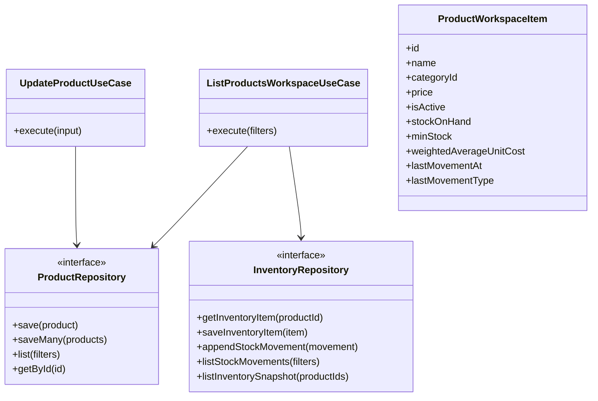
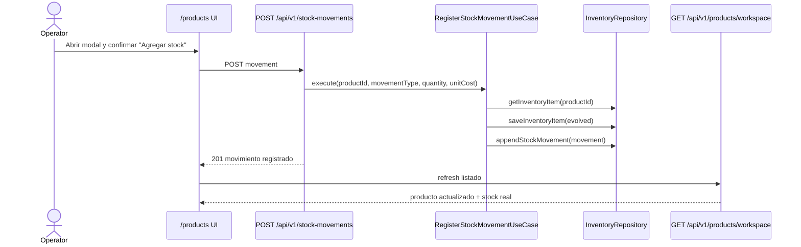
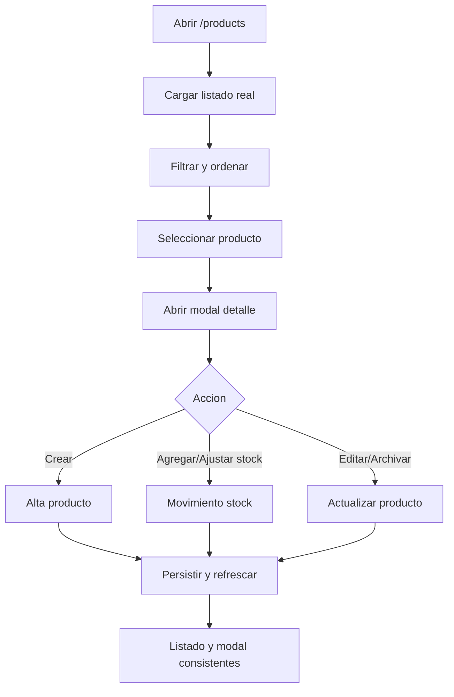

# [PRODUCTS-002] Feature: Integracion real de Productos e Inventario

## Metadata

**Feature ID**: `PRODUCTS-002`
**Status**: `done`
**Priority**: `high`
**Linked FR/NFR**: `FR-003`, `FR-004`, `FR-007`, `FR-008`, `FR-015`, `NFR-002`, `NFR-003`, `NFR-005`

---

## Business Goal

Convertir `/products` desde mock visual a workspace operativo real, sin mezclar dominio ni duplicar logica ya existente en `catalog` e `inventory`.

El objetivo no es solo "dibujar la pantalla", sino cerrar el circuito completo:

- UI usable para operacion diaria,
- persistencia consistente,
- comandos reales de producto y stock,
- pruebas del circuito end-to-end con backend real.

---

## Current Baseline

Hoy existe:

- Mock UI aprobado en `src/modules/products/presentation/components/ProductsInventoryMockPanel.tsx`
- `GET /api/v1/products`
- `POST /api/v1/products`
- `POST /api/v1/products/price-batches`
- `GET /api/v1/stock-movements`
- `POST /api/v1/stock-movements`

Gaps relevantes:

- No existe un read model unificado para listar producto + stock + costo promedio + ultimo movimiento.
- No existe `PATCH /api/v1/products/:id` para editar/archivar.
- No existe importacion masiva real para productos o stock.
- El stock visible hoy tiene una inconsistencia de modelo:
  - `products.stock` existe en catalogo
  - `inventory_items.stock_on_hand` existe en inventario
  - `CreateProductUseCase` crea producto con `initialStock`, pero no inicializa `inventory_items`
  - `RegisterStockMovementUseCase` muta `inventory_items`, no `products.stock`

Antes de conectar el workspace nuevo, hay que fijar una sola fuente de verdad del stock.

---

## Architecture Decision

### Pattern Choice

Para este problema conviene usar **Read Model / Query Model + existing command use cases**.

Razon:

- `/products` necesita datos agregados de `catalog` + `inventory`
- las operaciones de escritura siguen siendo comandos bien separados (`create product`, `register stock movement`, `bulk price update`, etc.)
- evita convertir `GET /api/v1/products` en un endpoint administrativo sobredimensionado

### Source of Truth for Stock

Para `PRODUCTS-002`, el stock visible del workspace debe salir de `inventory_items.stock_on_hand`.

`products.stock` debe quedar como:

- campo legacy temporal para compatibilidad,
- o candidato a deprecacion/migracion posterior,
- pero no como fuente de verdad para el workspace unificado.

---

## Target Outcome

Cuando la feature termine:

- `/products` lista productos reales con filtros, sort y paginacion
- cada card muestra stock actual real, stock minimo, precio y estado
- el modal de detalle muestra datos reales y movimientos recientes
- `Nuevo producto`, `Agregar stock`, `Ajustar stock`, `Editar producto` y `Archivar` funcionan
- los cambios persisten al recargar
- el circuito real queda cubierto con tests de UI, API, persistencia y logica

## Implementation Snapshot

Entregado en `2026-03-01`:

- migracion `20260301110000_products_workspace_real_integration.sql` con `sku`, `min_stock` y backfill de `inventory_items`
- `CreateProductUseCase` inicializa inventario real y registra movimiento inicial cuando hay stock de alta
- `RegisterStockMovementUseCase` mantiene sincronizado el espejo legacy `products.stock` y `products.cost`
- endpoint paginado `GET /api/v1/products/workspace`
- `PATCH /api/v1/products/:id`
- `POST /api/v1/products/import`
- `POST /api/v1/stock-movements/import`
- workspace real `/products` con listado, filtros, modal de detalle, alta, edicion, archivado, stock individual y lotes paste-based

Nota de alcance:

- la carga masiva se entrego en formato paste/import con validacion parcial por fila
- no se implemento un wizard de preview separado antes de persistir

---

## Scope

### In Scope

- Workspace `/products` conectado a backend real
- Read model unificado para listado operativo
- Modal de detalle conectado a datos reales
- Alta individual de producto
- Movimiento individual de stock
- Edicion y archivado de producto
- Plan de importacion masiva para productos y stock
- Cobertura de pruebas por capa y E2E real

### Out of Scope

- Descontar stock automaticamente desde ventas
- Eliminar inmediatamente `/catalog` y `/inventory`
- Reescribir toda la arquitectura de catalogo e inventario en un solo modulo

---

## Architecture Artifacts

### Class Diagram

### Sequence Diagram

### Activity Diagram

---

## Rollout Plan

### Phase 0 - Consistencia de persistencia

Objetivo: asegurar base de datos y use cases consistentes antes de montar la nueva UI real.

#### `P2-T01` Definir y documentar fuente de verdad del stock

- Decidir formalmente que `/products` lee stock desde `inventory_items.stock_on_hand`
- Registrar impacto en docs y contratos

#### `P2-T02` Reparar alta inicial de producto + inventario

- Crear slice que garantice que alta de producto inicializa inventario real
- Evitar que un producto nuevo quede con stock en `products.stock` pero sin `inventory_items`

#### `P2-T03` Extender port de inventario para snapshot masivo

- Agregar en `InventoryRepository` una operacion tipo `listInventorySnapshot(productIds)`
- Evitar `N+1` para el listado del workspace

#### Acceptance Criteria

- [x] Un producto nuevo puede crearse con stock inicial consistente
- [x] El stock mostrado por futuras queries no depende de `products.stock`
- [x] Existe consulta masiva de snapshot de inventario

#### Tests

- Unit: orquestacion de alta inicial producto + inventario
- Integration: repositorios Supabase escriben en tablas correctas
- API: contrato de alta sigue valido

---

### Phase 1 - Read model real para `/products`

Objetivo: reemplazar el mock por listado real sin tocar aun todas las mutaciones.

#### `P2-T04` Diseñar contrato `GET /api/v1/products/workspace`

Debe soportar:

- `q`
- `categoryId`
- `stockState`
- `activeOnly`
- `sort`
- `page`
- `pageSize`

#### `P2-T05` Implementar `ListProductsWorkspaceUseCase`

- Combina `ProductRepository` + snapshot de inventario
- Calcula estado visual (`with_stock`, `low_stock`, `out_of_stock`, `inactive`)
- Devuelve DTO listo para cards

#### `P2-T06` Implementar endpoint + DTOs + OpenAPI

- `GET /api/v1/products/workspace`
- respuesta paginada
- filtros y sort validados

#### `P2-T07` Conectar la grilla real en `/products`

- reemplazar fixtures mock por fetch real
- mantener modal todavia con acciones deshabilitadas o parciales si hace falta

#### Acceptance Criteria

- [x] `/products` carga datos reales con filtros y orden
- [x] La pantalla persiste al refrescar
- [x] No hay `N+1` por producto para stock

#### Tests

- Unit: `ListProductsWorkspaceUseCase`
- API contract: `products-workspace`
- Integration: repositorio snapshot masivo
- E2E UI real: filtros + sort + persistencia de recarga

---

### Phase 2 - Modal de detalle real

Objetivo: detalle util sin mutacion todavia o con mutaciones controladas.

#### `P2-T08` Conectar modal a item real del listado

- usar datos del read model para header, precio y estado

#### `P2-T09` Mostrar movimientos recientes reales

- reutilizar `GET /api/v1/stock-movements?productId=...`
- limitar cantidad y ordenar descendente

#### `P2-T10` Manejar estados de carga, error y producto inexistente

- modal robusto ante refresh, archivado o producto filtrado

#### Acceptance Criteria

- [x] El modal muestra datos reales del producto
- [x] El historial coincide con la persistencia real
- [x] El modal no rompe si el producto cambia o desaparece

#### Tests

- API integration: movimientos por producto
- E2E UI real: abrir modal, validar datos y movimientos

---

### Phase 3 - Alta individual real desde `/products`

Objetivo: mover `Nuevo producto` del mock a circuito real.

#### `P2-T11` Reusar o adaptar alta real existente para modal nuevo

- conectar formulario a `POST /api/v1/products`
- asegurar inicializacion de inventario de Phase 0

#### `P2-T12` Refrescar lista y seleccionar el nuevo producto

- invalidacion de listado
- feedback claro

#### Acceptance Criteria

- [x] Crear producto desde `/products` lo deja visible al volver a cargar
- [x] El producto aparece con stock consistente
- [x] El producto queda disponible tambien en `/sales` si esta activo

#### Tests

- API contract: `POST /api/v1/products`
- E2E UI real: alta desde `/products`
- Cross-module E2E: producto creado visible en `/sales`

---

### Phase 4 - Agregar stock / ajustar stock

Objetivo: cerrar el circuito de inventario diario desde el modal.

#### `P2-T13` Conectar modal de stock a `POST /api/v1/stock-movements`

- `inbound`
- `adjustment`
- `outbound` solo si se decide mantenerlo visible

#### `P2-T14` Refrescar card + modal luego de guardar

- stock actual
- ultimo movimiento
- historial reciente

#### Acceptance Criteria

- [x] Agregar stock actualiza listado y modal
- [x] Ajustar stock actualiza listado y modal
- [x] Errores de negocio se muestran sin desincronizar la UI

#### Tests

- Unit: `RegisterStockMovementUseCase`
- API contract: `POST /api/v1/stock-movements`
- E2E UI real: alta de stock y ajuste
- Persistence integration: stock y movimiento auditado

---

### Phase 5 - Editar y archivar producto

Objetivo: cerrar el CRUD operativo minimo.

#### `P2-T15` Extender dominio de producto

- editar nombre
- editar categoria
- editar precio
- editar imagen
- archivar / reactivar

#### `P2-T16` Extender `ProductRepository`

- `getById`
- soporte de update coherente

#### `P2-T17` Implementar `PATCH /api/v1/products/:id`

- cambios aditivos
- validacion DTO
- contrato OpenAPI

#### `P2-T18` Conectar modal de edicion y archivado

- refresco de lista
- respeto de filtro `Solo activos`

#### Acceptance Criteria

- [x] Editar producto persiste y refresca
- [x] Archivar oculta el producto bajo `Solo activos`
- [x] `/sales` deja de ofrecer el producto archivado

#### Tests

- Unit: `UpdateProductUseCase`
- API contract: `PATCH /api/v1/products/:id`
- E2E UI real: editar + archivar
- Cross-module E2E: producto archivado no aparece en `/sales`

---

### Phase 6 - Masivos

Objetivo: cubrir la operacion grande sin bloquear la entrega incremental.

#### `P2-T19` Definir POC y contrato de carga masiva de productos

- plantilla
- preview
- validacion por fila
- apply

#### `P2-T20` Definir contrato de stock masivo

- batch de movimientos
- preview
- errores parciales bloqueantes

#### `P2-T21` Integrar UI por wizard

- no en un batch junto con CRUD individual

#### Acceptance Criteria

- [x] Carga masiva procesa multiples filas y reporta validas e invalidas
- [x] Stock masivo procesa multiples filas y reporta validas e invalidas
- [x] Resultados muestran filas validas e invalidas

#### Tests

- API contract: batch import
- Integration: persistencia por lote
- E2E UI real: happy path + invalid rows

---

### Phase 7 - Convergencia y release

Objetivo: endurecer y decidir convivencia con `catalog` / `inventory`.

#### `P2-T22` Decidir convivencia de rutas

Opciones:

- [x] mantener `/catalog` y `/inventory` como fallback administrativo fuera del rail principal
- [ ] redirigir a `/products` cuando paridad funcional este cerrada

#### `P2-T23` Endurecer suite real de release

Circuitos minimos:

1. Alta producto en `/products`
2. Producto visible en `/sales`
3. Alta de stock desde `/products`
4. Stock y movimientos persistidos tras recarga
5. Edicion y archivado con impacto en filtros y `/sales`

#### Acceptance Criteria

- [x] El circuito principal corre en backend real
- [x] La release gate cubre `/products`
- [x] No quedan acciones mockeadas en el workspace
- [x] El rail principal converge en `Products`; `/catalog` y `/inventory` quedan como fallback administrativo directo

---

## Testing Strategy

### Unit

- `ListProductsWorkspaceUseCase`
- slice de alta producto + inventario inicial
- `UpdateProductUseCase`
- reglas de archivado y filtros de estado

### Integration

- `SupabaseProductRepository`
- `SupabaseInventoryRepository`
- query de snapshot masivo de stock
- integracion de producto + inventario al crear

### API Contract

- `GET /api/v1/products/workspace`
- `PATCH /api/v1/products/:id`
- `POST /api/v1/products`
- `POST /api/v1/stock-movements`
- futuros batch endpoints

### E2E UI Real

- `/products` lista y filtros
- detalle modal con movimientos
- alta producto
- agregar stock
- ajustar stock
- editar
- archivar

### Cross-Module Real

- producto creado en `/products` visible en `/sales`
- producto archivado deja de verse en `/sales`

Nota:

- no incluir "venta descuenta stock" en esta feature, porque hoy el flujo de ventas no integra inventario automaticamente

---

## Recommended Delivery Order

1. `Phase 0`
2. `Phase 1`
3. `Phase 2`
4. `Phase 3`
5. `Phase 4`
6. `Phase 5`
7. `Phase 7`
8. `Phase 6` solo si el alcance masivo sigue siendo prioridad inmediata

Razon:

- primero consistencia de datos,
- despues lectura real,
- luego mutaciones individuales,
- masivos al final por complejidad y superficie de error.

---

## Risks

- **Dualidad de stock (`products.stock` vs `inventory_items.stock_on_hand`)**
  Mitigacion: resolver fuente de verdad en `Phase 0`.

- **Scope creep al intentar reemplazar `/catalog` y `/inventory` demasiado pronto**
  Mitigacion: mantener convivencia hasta cerrar CRUD + stock + E2E real.

- **Importacion masiva mezclada con CRUD individual**
  Mitigacion: dejar batch workflows en fase separada.

---

## Definition of Done

- [x] `/products` funciona con backend real
- [x] No quedan datos mock ni acciones mock en el workspace
- [x] Persistencia consistente entre producto e inventario
- [x] CRUD individual cerrado
- [x] Stock individual cerrado
- [x] Contratos OpenAPI actualizados
- [x] E2E real cubre el circuito principal
- [x] Documentacion de workflow y trazabilidad actualizada
