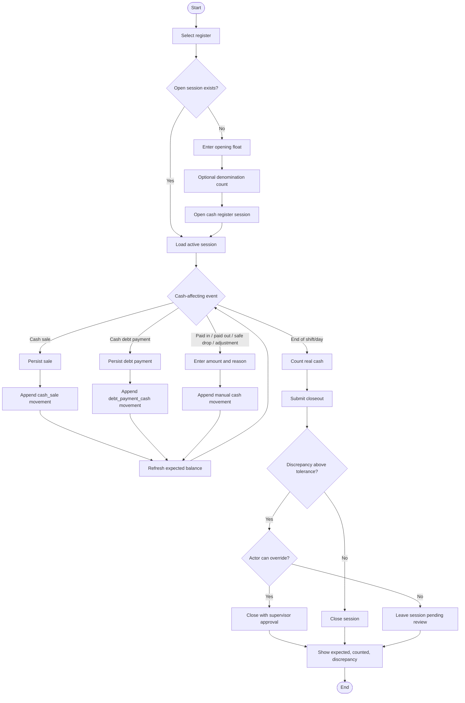

**GitHub Issue**: `TBD`
# Activity Diagram: Cash Register Daily Flow

```mermaid
flowchart TD
  A([Start]) --> B[Select register]
  B --> C{Open session exists?}
  C -->|Yes| D[Load active session]
  C -->|No| E[Enter opening float]
  E --> F[Optional denomination count]
  F --> G[Open cash register session]
  G --> D

  D --> H{Cash-affecting event}
  H -->|Cash sale| I[Persist sale]
  I --> J[Append cash_sale movement]
  J --> K[Refresh expected balance]
  K --> H

  H -->|Cash debt payment| L[Persist debt payment]
  L --> M[Append debt_payment_cash movement]
  M --> K

  H -->|Paid in / paid out / safe drop / adjustment| N[Enter amount and reason]
  N --> O[Append manual cash movement]
  O --> K

  H -->|End of shift/day| P[Count real cash]
  P --> Q[Submit closeout]
  Q --> R{Discrepancy above tolerance?}
  R -->|No| S[Close session]
  R -->|Yes| T{Actor can override?}
  T -->|Yes| U[Close with supervisor approval]
  T -->|No| V[Leave session pending review]
  U --> W[Show expected, counted, discrepancy]
  S --> W
  V --> W
  W --> X([End])
```
