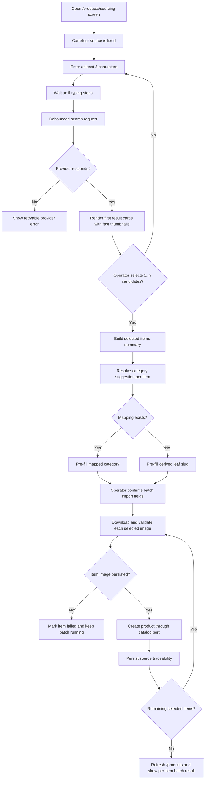

**GitHub Issue**: #37  
# Product Sourcing Activity Diagram

Feature reference: `SOURCING-001`

```mermaid
flowchart TD
    A[Open /products/sourcing screen] --> B[Carrefour source is fixed]
    B --> C[Enter at least 3 characters]
    C --> D[Wait until typing stops]
    D --> E[Debounced search request]
    E --> F{Provider responds?}
    F -- No --> G[Show retryable provider error]
    F -- Yes --> H[Render first result cards with fast thumbnails]
    H --> I{Operator selects 1..n candidates?}
    I -- No --> C
    I -- Yes --> J[Build selected-items summary]
    J --> K[Resolve category suggestion per item]
    K --> L{Mapping exists?}
    L -- Yes --> M[Pre-fill mapped category]
    L -- No --> N[Pre-fill derived leaf slug]
    M --> O[Operator confirms batch import fields]
    N --> O
    O --> P[Download and validate each selected image]
    P --> Q{Item image persisted?}
    Q -- No --> R[Mark item failed and keep batch running]
    Q -- Yes --> S[Create product through catalog port]
    S --> T[Persist source traceability]
    T --> U{Remaining selected items?}
    U -- Yes --> P
    U -- No --> V[Refresh /products and show per-item batch result]
```
