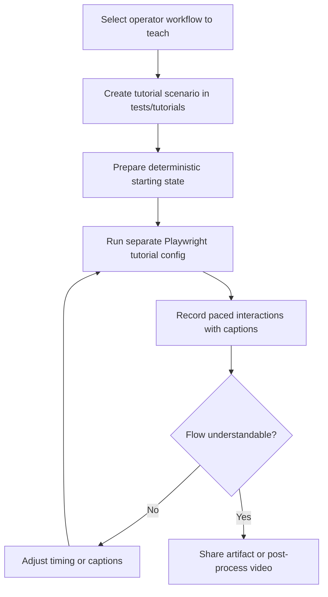

# Activity Diagram: Tutorial Video Production Flow

```mermaid
flowchart TD
    A[Select operator workflow to teach] --> B[Create tutorial scenario in tests/tutorials]
    B --> C[Prepare deterministic starting state]
    C --> D[Run separate Playwright tutorial config]
    D --> E[Record paced interactions with captions]
    E --> F{Flow understandable?}
    F -- No --> G[Adjust timing or captions]
    G --> D
    F -- Yes --> H[Share artifact or post-process video]
```
