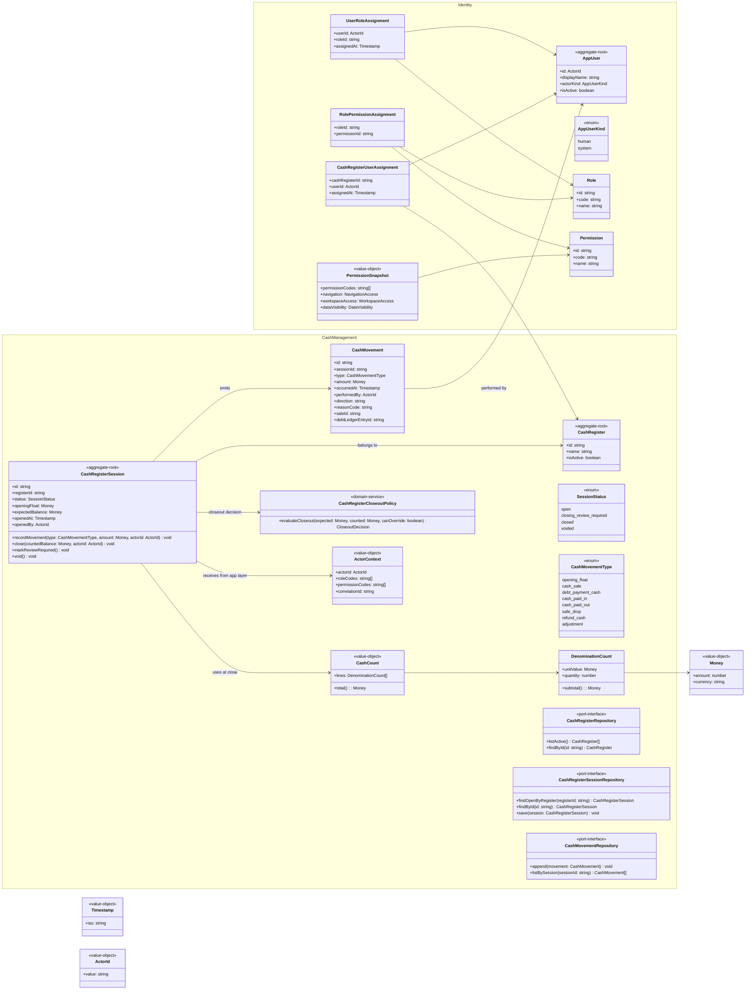

**GitHub Issue**: `TBD`
# Class Diagram: Cash Register Session Domain

```mermaid
classDiagram
direction LR

class Money {
  <<value-object>>
  +amount: number
  +currency: string
}

class Timestamp {
  <<value-object>>
  +iso: string
}

class ActorId {
  <<value-object>>
  +value: string
}

namespace Identity {
  class AppUser {
    <<aggregate-root>>
    +id: ActorId
    +displayName: string
    +actorKind: AppUserKind
    +isActive: boolean
  }

  class AppUserKind {
    <<enum>>
    human
    system
  }

  class Role {
    +id: string
    +code: string
    +name: string
  }

  class Permission {
    +id: string
    +code: string
    +name: string
  }

  class UserRoleAssignment {
    +userId: ActorId
    +roleId: string
    +assignedAt: Timestamp
  }

  class RolePermissionAssignment {
    +roleId: string
    +permissionId: string
  }

  class CashRegisterUserAssignment {
    +cashRegisterId: string
    +userId: ActorId
    +assignedAt: Timestamp
  }

  class PermissionSnapshot {
    <<value-object>>
    +permissionCodes: string[]
    +navigation: NavigationAccess
    +workspaceAccess: WorkspaceAccess
    +dataVisibility: DataVisibility
  }
}

namespace CashManagement {
  class CashRegister {
    <<aggregate-root>>
    +id: string
    +name: string
    +isActive: boolean
  }

  class SessionStatus {
    <<enum>>
    open
    closing_review_required
    closed
    voided
  }

  class CashMovementType {
    <<enum>>
    opening_float
    cash_sale
    debt_payment_cash
    cash_paid_in
    cash_paid_out
    safe_drop
    refund_cash
    adjustment
  }

  class CashRegisterSession {
    <<aggregate-root>>
    +id: string
    +registerId: string
    +status: SessionStatus
    +openingFloat: Money
    +expectedBalance: Money
    +openedAt: Timestamp
    +openedBy: ActorId
    +recordMovement(type: CashMovementType, amount: Money, actorId: ActorId) void
    +close(countedBalance: Money, actorId: ActorId) void
    +markReviewRequired() void
    +void() void
  }

  class CashMovement {
    +id: string
    +sessionId: string
    +type: CashMovementType
    +amount: Money
    +occurredAt: Timestamp
    +performedBy: ActorId
    +direction: string
    +reasonCode: string
    +saleId: string
    +debtLedgerEntryId: string
  }

  class CashCount {
    <<value-object>>
    +lines: DenominationCount[]
    +total(): Money
  }

  class DenominationCount {
    +unitValue: Money
    +quantity: number
    +subtotal(): Money
  }

  class CashRegisterRepository {
    <<port-interface>>
    +listActive() CashRegister[]
    +findById(id: string) CashRegister
  }

  class CashRegisterSessionRepository {
    <<port-interface>>
    +findOpenByRegister(registerId: string) CashRegisterSession
    +findById(id: string) CashRegisterSession
    +save(session: CashRegisterSession) void
  }

  class CashMovementRepository {
    <<port-interface>>
    +append(movement: CashMovement) void
    +listBySession(sessionId: string) CashMovement[]
  }

  class CashRegisterCloseoutPolicy {
    <<domain-service>>
    +evaluateCloseout(expected: Money, counted: Money, canOverride: boolean) CloseoutDecision
  }

  class ActorContext {
    <<value-object>>
    +actorId: ActorId
    +roleCodes: string[]
    +permissionCodes: string[]
    +correlationId: string
  }
}

CashRegisterSession --> CashRegister : belongs to
CashRegisterSession --> CashCount : uses at close
CashRegisterSession --> CashMovement : emits
CashRegisterSession --> CashRegisterCloseoutPolicy : closeout decision
CashRegisterSession --> ActorContext : receives from app layer
CashMovement --> AppUser : performed by
UserRoleAssignment --> AppUser
UserRoleAssignment --> Role
RolePermissionAssignment --> Role
RolePermissionAssignment --> Permission
CashRegisterUserAssignment --> AppUser
CashRegisterUserAssignment --> CashRegister
PermissionSnapshot --> Permission
DenominationCount --> Money
CashCount --> DenominationCount
```
