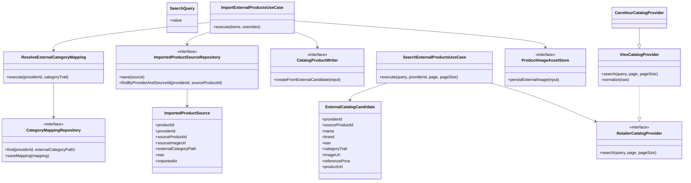

# Product Sourcing Class Diagram

Feature reference: `SOURCING-001`

```mermaid
classDiagram
    class SearchQuery {
      +value
    }

    class ExternalCatalogCandidate {
      +providerId
      +sourceProductId
      +name
      +brand
      +ean
      +categoryTrail
      +imageUrl
      +referencePrice
      +productUrl
    }

    class ImportedProductSource {
      +productId
      +providerId
      +sourceProductId
      +sourceImageUrl
      +externalCategoryPath
      +ean
      +importedAt
    }

    class RetailerCatalogProvider {
      <<interface>>
      +search(query, page, pageSize)
    }

    class ProductImageAssetStore {
      <<interface>>
      +persistExternalImage(input)
    }

    class CatalogProductWriter {
      <<interface>>
      +createFromExternalCandidate(input)
    }

    class ImportedProductSourceRepository {
      <<interface>>
      +save(source)
      +findByProviderAndSourceId(providerId, sourceProductId)
    }

    class CategoryMappingRepository {
      <<interface>>
      +find(providerId, externalCategoryPath)
      +saveMapping(mapping)
    }

    class SearchExternalProductsUseCase {
      +execute(query, providerId, page, pageSize)
    }

    class ImportExternalProductsUseCase {
      +execute(items, overrides)
    }

    class ResolveExternalCategoryMapping {
      +execute(providerId, categoryTrail)
    }

    class VtexCatalogProvider {
      +search(query, page, pageSize)
      -normalize(raw)
    }

    class CarrefourCatalogProvider

    SearchExternalProductsUseCase --> RetailerCatalogProvider
    SearchExternalProductsUseCase --> ExternalCatalogCandidate
    ImportExternalProductsUseCase --> ProductImageAssetStore
    ImportExternalProductsUseCase --> CatalogProductWriter
    ImportExternalProductsUseCase --> ImportedProductSourceRepository
    ImportExternalProductsUseCase --> ResolveExternalCategoryMapping
    ResolveExternalCategoryMapping --> CategoryMappingRepository
    ImportedProductSourceRepository --> ImportedProductSource
    CarrefourCatalogProvider --|> VtexCatalogProvider
    VtexCatalogProvider ..|> RetailerCatalogProvider
```
