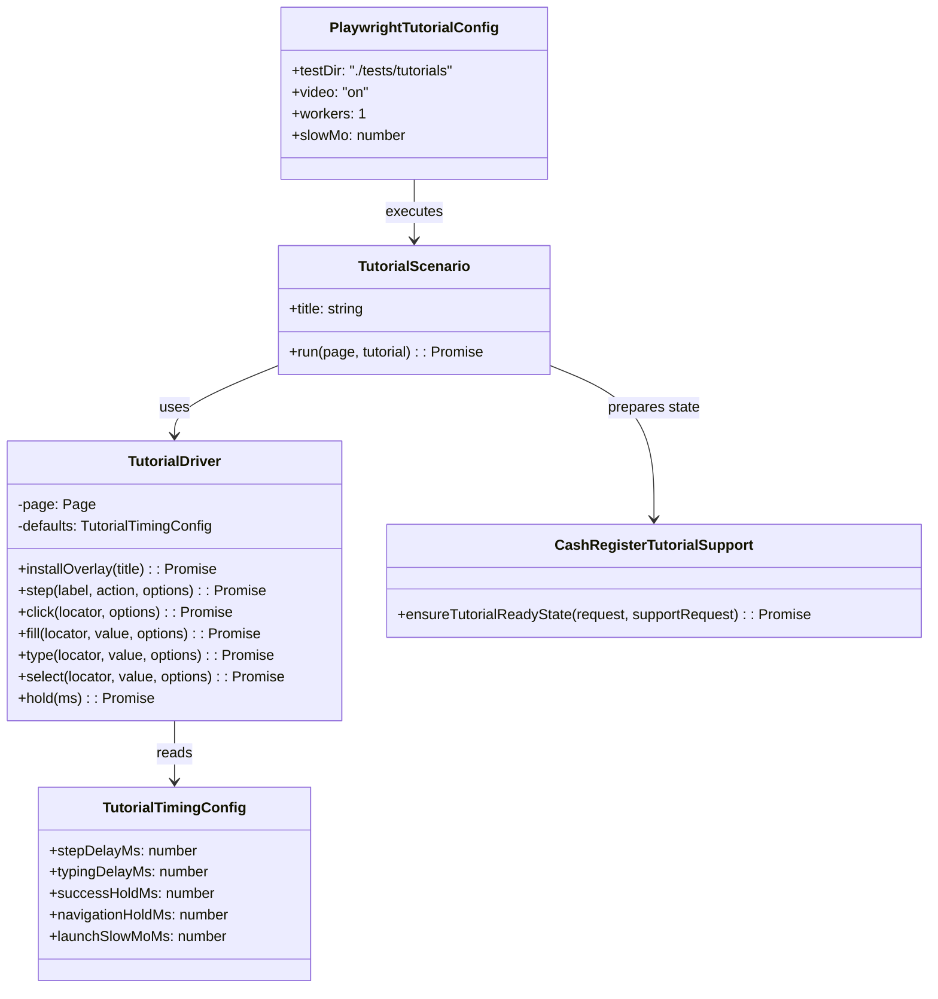

# Class Diagram: Tutorial Recording Suite

```mermaid
classDiagram
    class TutorialScenario {
      +title: string
      +run(page, tutorial): Promise<void>
    }

    class TutorialDriver {
      -page: Page
      -defaults: TutorialTimingConfig
      +installOverlay(title): Promise<void>
      +step(label, action, options): Promise<void>
      +click(locator, options): Promise<void>
      +fill(locator, value, options): Promise<void>
      +type(locator, value, options): Promise<void>
      +select(locator, value, options): Promise<void>
      +hold(ms): Promise<void>
    }

    class TutorialTimingConfig {
      +stepDelayMs: number
      +typingDelayMs: number
      +successHoldMs: number
      +navigationHoldMs: number
      +launchSlowMoMs: number
    }

    class CashRegisterTutorialSupport {
      +ensureTutorialReadyState(request, supportRequest): Promise<void>
    }

    class PlaywrightTutorialConfig {
      +testDir: "./tests/tutorials"
      +video: "on"
      +workers: 1
      +slowMo: number
    }

    TutorialScenario --> TutorialDriver : uses
    TutorialDriver --> TutorialTimingConfig : reads
    TutorialScenario --> CashRegisterTutorialSupport : prepares state
    PlaywrightTutorialConfig --> TutorialScenario : executes
```
