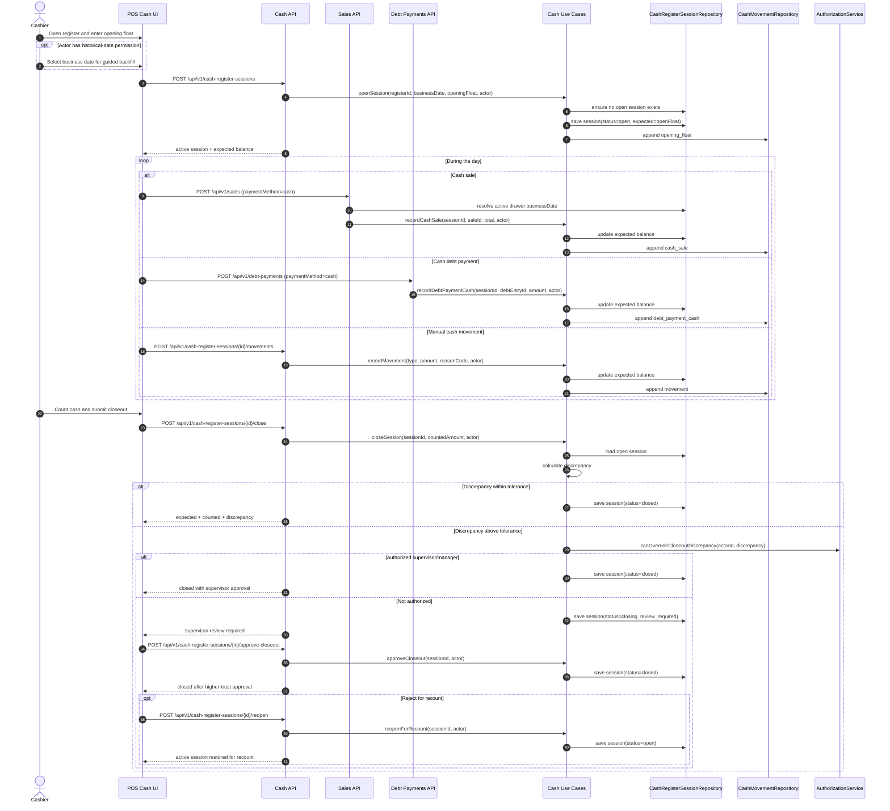

**GitHub Issue**: `TBD`
# Sequence Diagram: Cash Register Open, Cash Activity, and Close

```mermaid
sequenceDiagram
  autonumber
  actor Cashier
  participant UI as POS Cash UI
  participant CashAPI as Cash API
  participant SalesAPI as Sales API
  participant DebtAPI as Debt Payments API
  participant CashUC as Cash Use Cases
  participant SessionRepo as CashRegisterSessionRepository
  participant MovementRepo as CashMovementRepository
  participant Authz as AuthorizationService

  Cashier->>UI: Open register and enter opening float
  opt Actor has historical-date permission
    Cashier->>UI: Select business date for guided backfill
  end
  UI->>CashAPI: POST /api/v1/cash-register-sessions
  CashAPI->>CashUC: openSession(registerId, businessDate, openingFloat, actor)
  CashUC->>SessionRepo: ensure no open session exists
  CashUC->>SessionRepo: save session(status=open, expected=openFloat)
  CashUC->>MovementRepo: append opening_float
  CashAPI-->>UI: active session + expected balance

  loop During the day
    alt Cash sale
      UI->>SalesAPI: POST /api/v1/sales (paymentMethod=cash)
      SalesAPI->>SessionRepo: resolve active drawer businessDate
      SalesAPI->>CashUC: recordCashSale(sessionId, saleId, total, actor)
      CashUC->>SessionRepo: update expected balance
      CashUC->>MovementRepo: append cash_sale
    else Cash debt payment
      UI->>DebtAPI: POST /api/v1/debt-payments (paymentMethod=cash)
      DebtAPI->>CashUC: recordDebtPaymentCash(sessionId, debtEntryId, amount, actor)
      CashUC->>SessionRepo: update expected balance
      CashUC->>MovementRepo: append debt_payment_cash
    else Manual cash movement
      UI->>CashAPI: POST /api/v1/cash-register-sessions/{id}/movements
      CashAPI->>CashUC: recordMovement(type, amount, reasonCode, actor)
      CashUC->>SessionRepo: update expected balance
      CashUC->>MovementRepo: append movement
    end
  end

  Cashier->>UI: Count cash and submit closeout
  UI->>CashAPI: POST /api/v1/cash-register-sessions/{id}/close
  CashAPI->>CashUC: closeSession(sessionId, countedAmount, actor)
  CashUC->>SessionRepo: load open session
  CashUC->>CashUC: calculate discrepancy

  alt Discrepancy within tolerance
    CashUC->>SessionRepo: save session(status=closed)
    CashAPI-->>UI: expected + counted + discrepancy
  else Discrepancy above tolerance
    CashUC->>Authz: canOverrideCloseoutDiscrepancy(actorId, discrepancy)
    alt Authorized supervisor/manager
      CashUC->>SessionRepo: save session(status=closed)
      CashAPI-->>UI: closed with supervisor approval
    else Not authorized
      CashUC->>SessionRepo: save session(status=closing_review_required)
      CashAPI-->>UI: supervisor review required
      UI->>CashAPI: POST /api/v1/cash-register-sessions/{id}/approve-closeout
      CashAPI->>CashUC: approveCloseout(sessionId, actor)
      CashUC->>SessionRepo: save session(status=closed)
      CashAPI-->>UI: closed after higher-trust approval
      opt Reject for recount
        UI->>CashAPI: POST /api/v1/cash-register-sessions/{id}/reopen
        CashAPI->>CashUC: reopenForRecount(sessionId, actor)
        CashUC->>SessionRepo: save session(status=open)
        CashAPI-->>UI: active session restored for recount
      end
    end
  end
```
