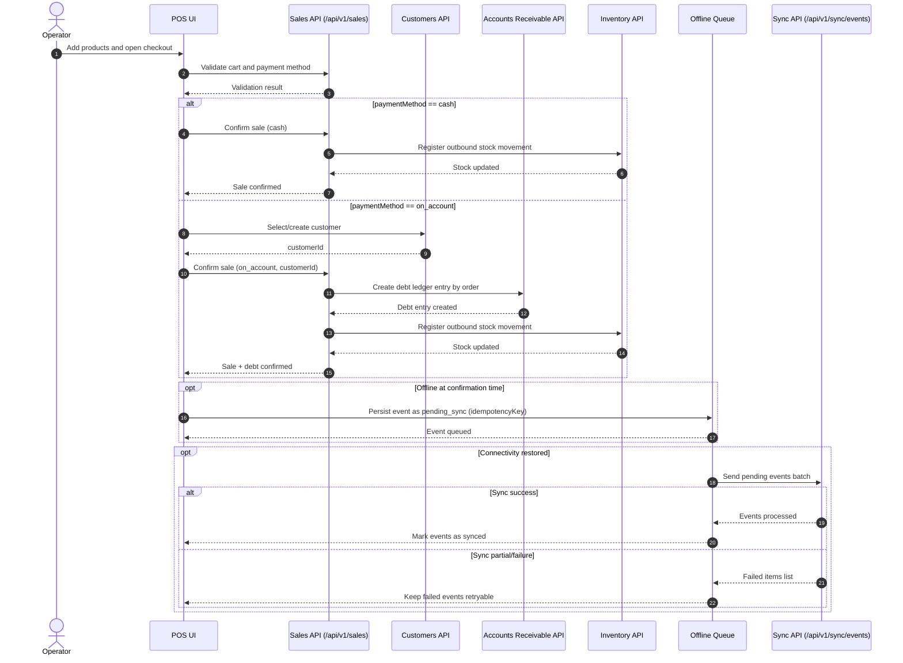

# Sequence Diagram: Checkout and Debt Flow

```mermaid
sequenceDiagram
  autonumber
  actor Operator
  participant UI as POS UI
  participant Sales as Sales API (/api/v1/sales)
  participant Cust as Customers API
  participant AR as Accounts Receivable API
  participant Inv as Inventory API
  participant Queue as Offline Queue
  participant Sync as Sync API (/api/v1/sync/events)

  Operator->>UI: Add products and open checkout
  UI->>Sales: Validate cart and payment method
  Sales-->>UI: Validation result

  alt paymentMethod == cash
    UI->>Sales: Confirm sale (cash)
    Sales->>Inv: Register outbound stock movement
    Inv-->>Sales: Stock updated
    Sales-->>UI: Sale confirmed
  else paymentMethod == on_account
    UI->>Cust: Select/create customer
    Cust-->>UI: customerId
    UI->>Sales: Confirm sale (on_account, customerId)
    Sales->>AR: Create debt ledger entry by order
    AR-->>Sales: Debt entry created
    Sales->>Inv: Register outbound stock movement
    Inv-->>Sales: Stock updated
    Sales-->>UI: Sale + debt confirmed
  end

  opt Offline at confirmation time
    UI->>Queue: Persist event as pending_sync (idempotencyKey)
    Queue-->>UI: Event queued
  end

  opt Connectivity restored
    Queue->>Sync: Send pending events batch
    alt Sync success
      Sync-->>Queue: Events processed
      Queue-->>UI: Mark events as synced
    else Sync partial/failure
      Sync-->>Queue: Failed items list
      Queue-->>UI: Keep failed events retryable
    end
  end
```
