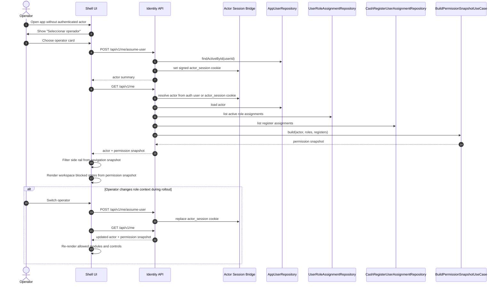

**GitHub Issue**: `TBD`
# Sequence Diagram: Identity Bridge and Permission Snapshot Bootstrap

```mermaid
sequenceDiagram
  autonumber
  actor Operator
  participant UI as Shell UI
  participant IdentityAPI as Identity API
  participant SessionBridge as Actor Session Bridge
  participant UserRepo as AppUserRepository
  participant RoleRepo as UserRoleAssignmentRepository
  participant RegisterRepo as CashRegisterUserAssignmentRepository
  participant SnapshotUC as BuildPermissionSnapshotUseCase

  Operator->>UI: Open app without authenticated actor
  UI->>Operator: Show "Seleccionar operador"
  Operator->>UI: Choose operator card
  UI->>IdentityAPI: POST /api/v1/me/assume-user
  IdentityAPI->>UserRepo: findActiveById(userId)
  IdentityAPI->>SessionBridge: set signed actor_session cookie
  IdentityAPI-->>UI: actor summary

  UI->>IdentityAPI: GET /api/v1/me
  IdentityAPI->>SessionBridge: resolve actor from auth user or actor_session cookie
  IdentityAPI->>UserRepo: load actor
  IdentityAPI->>RoleRepo: list active role assignments
  IdentityAPI->>RegisterRepo: list register assignments
  IdentityAPI->>SnapshotUC: build(actor, roles, registers)
  SnapshotUC-->>IdentityAPI: permission snapshot
  IdentityAPI-->>UI: actor + permission snapshot

  UI->>UI: Filter side rail from navigation snapshot
  UI->>UI: Render workspace blocked states from permission snapshot

  alt Operator changes role context during rollout
    Operator->>UI: Switch operator
    UI->>IdentityAPI: POST /api/v1/me/assume-user
    IdentityAPI->>SessionBridge: replace actor_session cookie
    UI->>IdentityAPI: GET /api/v1/me
    IdentityAPI-->>UI: updated actor + permission snapshot
    UI->>UI: Re-render allowed modules and controls
  end
```
