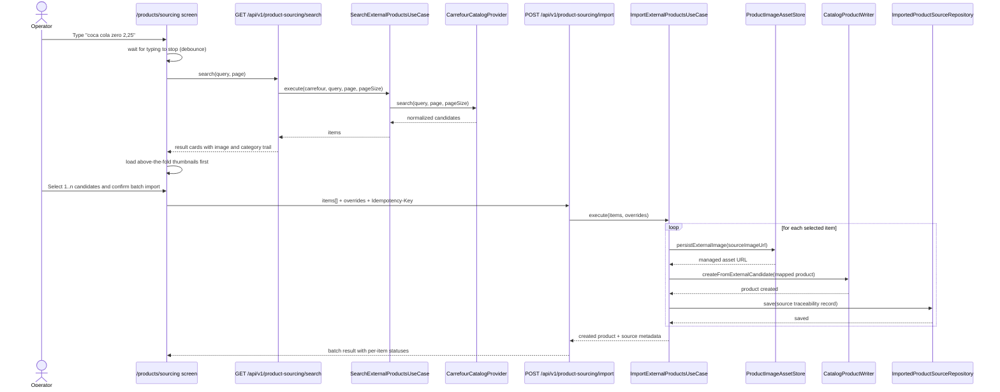

**GitHub Issue**: #35  
# Product Sourcing Search and Import Sequence

Feature reference: `SOURCING-001`

```mermaid
sequenceDiagram
    actor Operator
    participant UI as /products/sourcing screen
    participant SearchAPI as GET /api/v1/product-sourcing/search
    participant SearchUC as SearchExternalProductsUseCase
    participant Provider as CarrefourCatalogProvider
    participant ImportAPI as POST /api/v1/product-sourcing/import
    participant ImportUC as ImportExternalProductsUseCase
    participant AssetStore as ProductImageAssetStore
    participant Catalog as CatalogProductWriter
    participant SourceRepo as ImportedProductSourceRepository

    Operator->>UI: Type "coca cola zero 2,25"
    UI->>UI: wait for typing to stop (debounce)
    UI->>SearchAPI: search(query, page)
    SearchAPI->>SearchUC: execute(carrefour, query, page, pageSize)
    SearchUC->>Provider: search(query, page, pageSize)
    Provider-->>SearchUC: normalized candidates
    SearchUC-->>SearchAPI: items
    SearchAPI-->>UI: result cards with image and category trail
    UI->>UI: load above-the-fold thumbnails first

    Operator->>UI: Select 1..n candidates and confirm batch import
    UI->>ImportAPI: items[] + overrides + Idempotency-Key
    ImportAPI->>ImportUC: execute(items, overrides)
    loop for each selected item
        ImportUC->>AssetStore: persistExternalImage(sourceImageUrl)
        AssetStore-->>ImportUC: managed asset URL
        ImportUC->>Catalog: createFromExternalCandidate(mapped product)
        Catalog-->>ImportUC: product created
        ImportUC->>SourceRepo: save(source traceability record)
        SourceRepo-->>ImportUC: saved
    end
    ImportUC-->>ImportAPI: created product + source metadata
    ImportAPI-->>UI: batch result with per-item statuses
```
