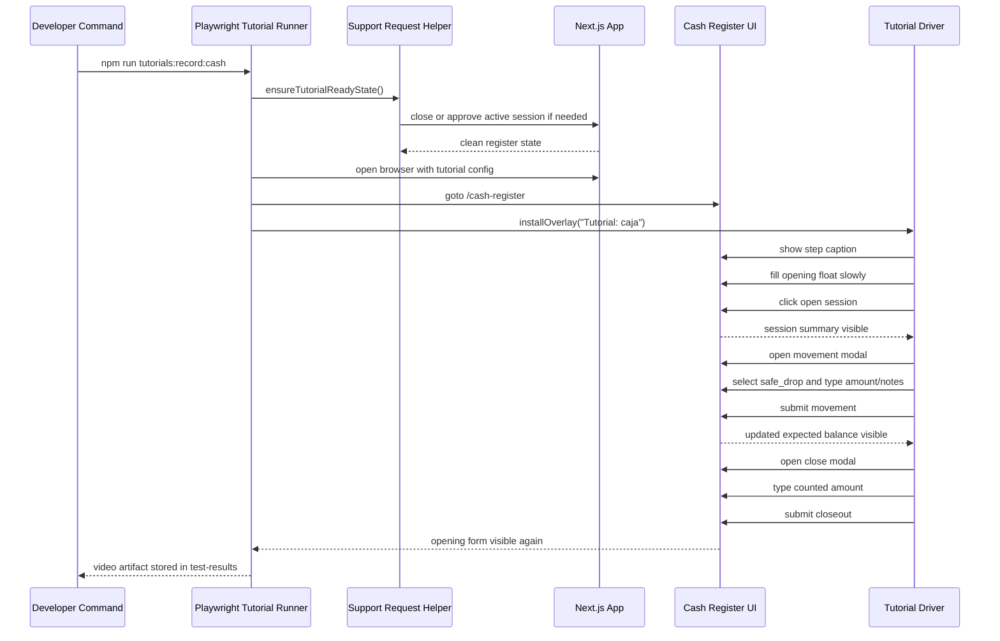

# Sequence Diagram: Record Cash Register Tutorial

```mermaid
sequenceDiagram
    participant Dev as Developer Command
    participant PW as Playwright Tutorial Runner
    participant Support as Support Request Helper
    participant App as Next.js App
    participant UI as Cash Register UI
    participant Driver as Tutorial Driver

    Dev->>PW: npm run tutorials:record:cash
    PW->>Support: ensureTutorialReadyState()
    Support->>App: close or approve active session if needed
    App-->>Support: clean register state
    PW->>App: open browser with tutorial config
    PW->>UI: goto /cash-register
    PW->>Driver: installOverlay("Tutorial: caja")
    Driver->>UI: show step caption
    Driver->>UI: fill opening float slowly
    Driver->>UI: click open session
    UI-->>Driver: session summary visible
    Driver->>UI: open movement modal
    Driver->>UI: select safe_drop and type amount/notes
    Driver->>UI: submit movement
    UI-->>Driver: updated expected balance visible
    Driver->>UI: open close modal
    Driver->>UI: type counted amount
    Driver->>UI: submit closeout
    UI-->>PW: opening form visible again
    PW-->>Dev: video artifact stored in test-results
```
