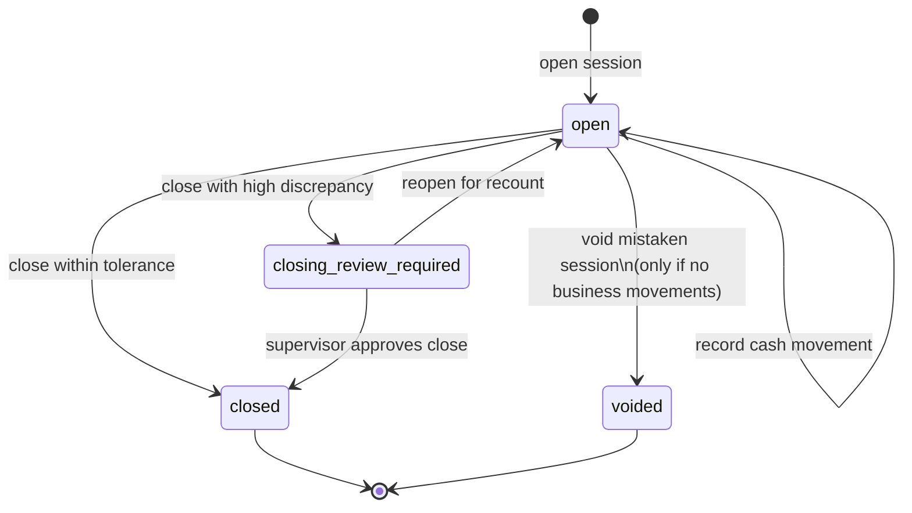

**GitHub Issue**: `TBD`
# State Diagram: Cash Register Session

```mermaid
stateDiagram-v2
  [*] --> open : open session

  open --> open : record cash movement
  open --> closed : close within tolerance
  open --> closing_review_required : close with high discrepancy
  open --> voided : void mistaken session\n(only if no business movements)

  closing_review_required --> closed : supervisor approves close
  closing_review_required --> open : reopen for recount

  closed --> [*]
  voided --> [*]
```
