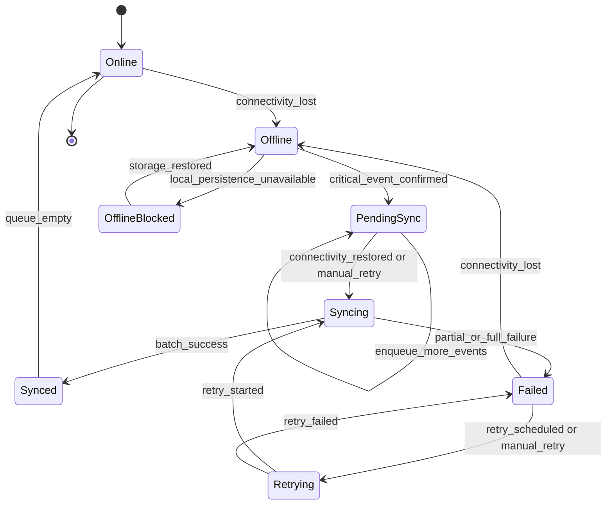

# State Diagram: Offline Sync Lifecycle

```mermaid
stateDiagram-v2
  [*] --> Online

  Online --> Offline: connectivity_lost
  Offline --> PendingSync: critical_event_confirmed
  Offline --> OfflineBlocked: local_persistence_unavailable
  OfflineBlocked --> Offline: storage_restored

  PendingSync --> PendingSync: enqueue_more_events
  PendingSync --> Syncing: connectivity_restored or manual_retry

  Syncing --> Synced: batch_success
  Syncing --> Failed: partial_or_full_failure

  Failed --> Retrying: retry_scheduled or manual_retry
  Retrying --> Syncing: retry_started
  Retrying --> Failed: retry_failed

  Synced --> Online: queue_empty
  Failed --> Offline: connectivity_lost
  Online --> [*]
```
