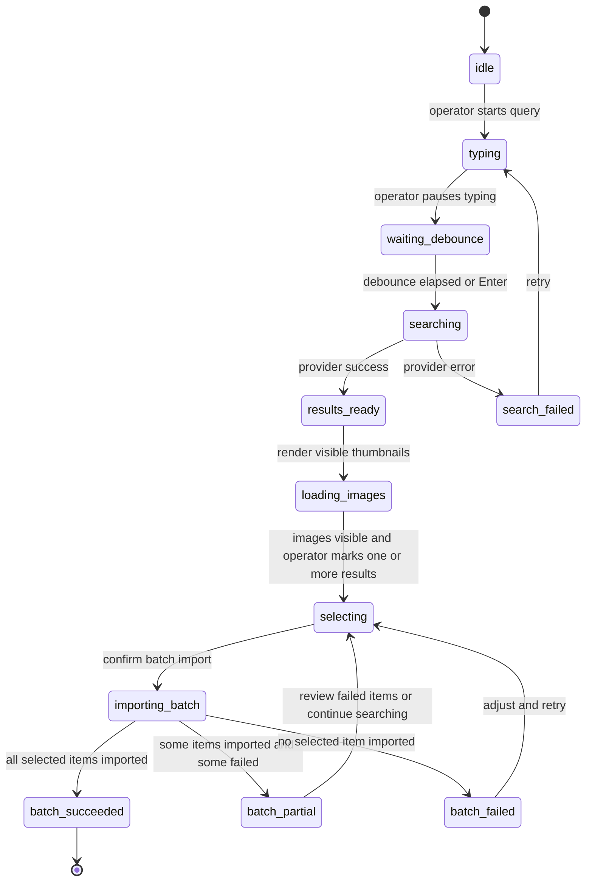

# Product Sourcing Import Session State Diagram

Feature reference: `SOURCING-001`

```mermaid
stateDiagram-v2
    [*] --> idle
    idle --> typing : operator starts query
    typing --> waiting_debounce : operator pauses typing
    waiting_debounce --> searching : debounce elapsed or Enter
    searching --> results_ready : provider success
    searching --> search_failed : provider error
    search_failed --> typing : retry
    results_ready --> loading_images : render visible thumbnails
    loading_images --> selecting : images visible and operator marks one or more results
    selecting --> importing_batch : confirm batch import
    importing_batch --> batch_succeeded : all selected items imported
    importing_batch --> batch_partial : some items imported and some failed
    importing_batch --> batch_failed : no selected item imported
    batch_failed --> selecting : adjust and retry
    batch_partial --> selecting : review failed items or continue searching
    batch_succeeded --> [*]
```
