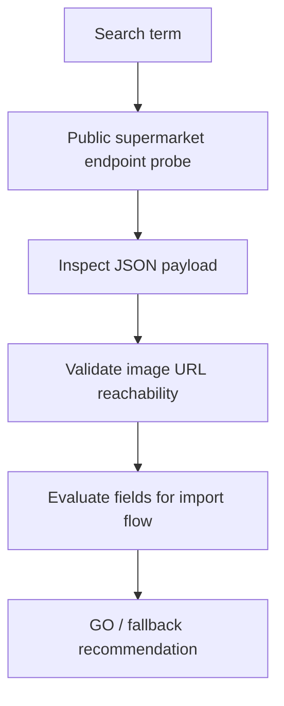

# POC: Product Sourcing via Public Supermarket Catalog APIs

## POC Overview

**POC ID**: `POC-001`  
**Feature**: `SOURCING-001`  
**Status**: `completed`  
**GitHub Issue**: #33  
**Priority**: `high`  
**Created**: `2026-03-01`  
**Duration**: `1 session`  
**Assignee**: `TBD`

### Hypothesis Statement

We believe the first version of external product sourcing can avoid browser automation because major supermarket sites expose public catalog search endpoints that already return the fields needed for assisted product onboarding: title, image, category path, barcode, and reference price.

### Success Criteria

- [x] At least one retailer exposes a public search response usable without Playwright.
- [x] The response includes a descriptive product title that differentiates variants.
- [x] The response includes at least one direct image URL for the product.
- [x] The response includes enough category information to suggest an internal category.
- [x] The image URL is directly downloadable from the server side.

---

## Problem Statement

### Current State

The app already supports guided product onboarding, but the operator still needs to source real product images manually. That does not scale well for a low-technical user and makes product recognition weaker in both the products workspace and checkout.

### Desired State

The operator types a product name plus variant hints, sees a short list with clear Carrefour images, selects one or many correct items, and imports them into the internal catalog without leaving the app.

### Key Questions to Answer

1. **Technical Feasibility**: Can we query catalog data directly without browser automation?
2. **Business Viability**: Does the external response contain enough information to reduce onboarding friction materially?
3. **User Experience**: Are the titles and images descriptive enough to disambiguate close variants?
4. **Performance Impact**: Can we page the provider requests instead of pulling full result lists?
5. **Integration Complexity**: Can one adapter support multiple supermarkets if they share the same platform?

---

## Experiment Design

### Approach

**Method**: `research`

### Scope & Limitations

**Included**:

- probing live catalog search endpoints,
- inspecting title, category, barcode, image, and price fields,
- testing image download reachability,
- checking windowed result fetches.

**Excluded**:

- production traffic testing,
- legal review of provider terms,
- full HTML scraping,
- full category mapping implementation,
- storage upload implementation.

### Technical Approach



---

## Execution Evidence

### Reproducible Probe

Reusable script:

- `workflow-manager/docs/pocs/scripts/product-sourcing-vtex-probe.mjs`

Example:

```bash
node workflow-manager/docs/pocs/scripts/product-sourcing-vtex-probe.mjs carrefour "coca cola zero 2,25" 3
```

### Live Endpoint Checks

| Provider | Endpoint | Result | Key Observation |
| --- | --- | --- | --- |
| Carrefour | [carrefour search](https://www.carrefour.com.ar/api/catalog_system/pub/products/search/coca%20cola?_from=0&_to=2) | `200` | Returns `productName`, `categories`, `items[0].images`, `ean`, `Price` |
| Jumbo | [jumbo search](https://www.jumbo.com.ar/api/catalog_system/pub/products/search/coca%20cola?_from=0&_to=2) | `200` | Same VTEX-like payload shape as Carrefour |
| Disco | [disco search](https://www.disco.com.ar/api/catalog_system/pub/products/search/coca%20cola?_from=0&_to=2) | `200` | Same payload family as Jumbo |
| Vea | [vea search](https://www.vea.com.ar/api/catalog_system/pub/products/search/coca%20cola?_from=0&_to=2) | `200` | Same payload family as Jumbo |

### Product Decision After Review

Even though four providers were technically reachable, the implementation decision for v1 is now:

- **chosen source**: `Carrefour Argentina`
- **source URL**: `https://www.carrefour.com.ar/`
- **reason**: the product images look more normalized, visually consistent, and easier to recognize quickly

### Sample Observations

#### Carrefour

- Product name: `Gaseosa cola Coca Cola Zero 2,25 lts`
- Category trail: `/Bebidas/Gaseosas/Gaseosas cola/`
- EAN: `7790895067570`
- Image URL present: yes
- Reference price present: yes

#### Jumbo

- Product name: `Coca-cola Zero 2,25 Lt`
- Category trail: `/Bebidas/Gaseosas/Cola/`
- EAN: `7790895067570`
- Image URL present: yes
- Reference price present: yes

### Image Reachability

Validated examples:

- [Carrefour image](https://carrefourar.vteximg.com.br/arquivos/ids/395283/7790895067570_E01.jpg?v=638326494223030000)
- [Jumbo image](https://jumboargentina.vteximg.com.br/arquivos/ids/799920/Gaseosa-Coca-Cola-Sin-Azucar-2-25lt-1-19721.jpg?v=638349573899270000)

Observed server-side result:

- `HTTP 200`
- `content-type: image/jpeg`
- public cache headers available

---

## Metrics and Validation

| Metric | Target | Result | Status |
| --- | --- | --- | --- |
| Direct search endpoint availability | At least 1 provider | 4 providers answered `200` | pass |
| Carrefour viability as single-source baseline | Confirmed | Search + images + category trail available | pass |
| Variant-rich product title | Present | Present on all tested providers | pass |
| Primary image URL | Present | Present on tested products | pass |
| Category trail | Present | Present on tested products | pass |
| Windowed fetch support | Supported | `_from` / `_to` returned bounded lists | pass |

### Validation Methods

- **Technical Validation**: live `fetch` / `curl` probes from the repo environment
- **Performance Validation**: bounded result windows with `_from` / `_to`
- **UX Validation**: manual inspection of nearby variants in titles
- **Business Validation**: check whether title + image materially improve operator recognition

---

## Architecture Findings

### What Worked

- Direct HTTP search worked without Playwright.
- The returned titles already contain meaningful variant descriptors.
- The JSON shape includes the exact fields needed for a search result card.
- Multiple supermarkets appear to share the same VTEX-style response family.
- Carrefour is a strong first source because its images were reviewed as the most visually consistent for this product onboarding use case.
- Carrefour image responses also exposed public caching headers, which is favorable for a fast visual search screen.

### What Did Not Need to Be Used

- No DOM automation was required for the tested providers.
- No login/session bootstrap was required for the baseline probes.

### Unexpected Findings

- `Price` looked usable as a reference field, but some `ListPrice` values looked inconsistent and should not drive any automatic repricing logic.
- Provider pricing may still be branch-sensitive or cookie-sensitive even if the endpoint is public.
- The APIs appear stable enough for a PoC, but they are undocumented from the application point of view.
- Even a very specific query does not guarantee that the exact variant is ranked first, so the UI must rely on explicit visual/operator selection instead of auto-picking the first hit.
- That same ranking behavior means the import flow benefits from multi-selection plus manual confirmation rather than repeated one-by-one confirmation loops.

---

## Risks and Mitigation

| Risk | Probability | Impact | Mitigation |
| --- | --- | --- | --- |
| Provider changes endpoint shape | medium | high | isolate providers behind adapters and add smoke probes |
| Legal/TOS restriction appears later | medium | high | review usage terms before production-heavy usage |
| Search returns too many results | medium | medium | limit page size and keep Carrefour-only UX first |
| Price data is region-dependent | high | medium | treat price as optional reference only in v1 |

---

## Recommendation

**Decision**: `GO`

Recommended implementation path:

1. Build `product-sourcing` as a dedicated vertical slice.
2. Use Carrefour Argentina as the only source in v1.
3. Use HTTP provider adapters as the primary integration mechanism.
4. Keep Playwright only as a fallback for future providers that do not expose usable public catalog responses.
5. Support multi-selection of search results and a batch import confirmation flow.
6. Implement the selection flow in a dedicated screen with debounced search and fast-loading thumbnails.

---

## Sources

- [Carrefour search endpoint](https://www.carrefour.com.ar/api/catalog_system/pub/products/search/coca%20cola?_from=0&_to=2)
- [Jumbo search endpoint](https://www.jumbo.com.ar/api/catalog_system/pub/products/search/coca%20cola?_from=0&_to=2)
- [Disco search endpoint](https://www.disco.com.ar/api/catalog_system/pub/products/search/coca%20cola?_from=0&_to=2)
- [Vea search endpoint](https://www.vea.com.ar/api/catalog_system/pub/products/search/coca%20cola?_from=0&_to=2)
- [Carrefour image URL sample](https://carrefourar.vteximg.com.br/arquivos/ids/395283/7790895067570_E01.jpg?v=638326494223030000)
- [Jumbo image URL sample](https://jumboargentina.vteximg.com.br/arquivos/ids/799920/Gaseosa-Coca-Cola-Sin-Azucar-2-25lt-1-19721.jpg?v=638349573899270000)
